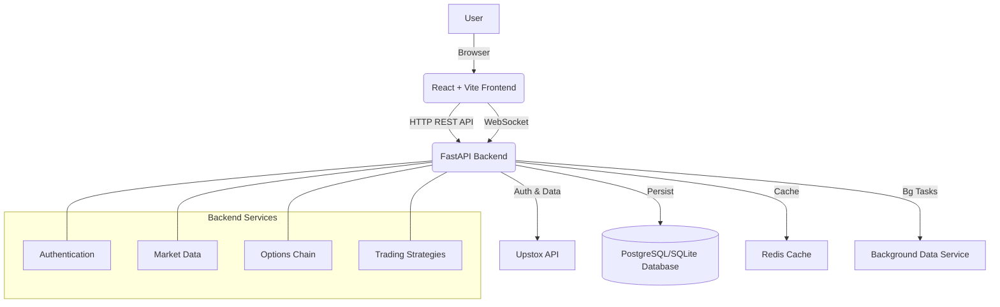

# VEGA-TRADE

VEGA TRADER is a sophisticated algorithmic trading platform designed for the Indian stock market (NSE/BSE). It integrates with Upstox for real-time market data and order execution, providing advanced analytical tools for options trading, portfolio management, and automated trading strategies.

## System Architecture



## Tech Stack

### Backend
- **Framework**: FastAPI (Python)
- **Database**: SQLite / SQLAlchemy
- **Authentication**: JWT + Upstox OAuth
- **Market Data**: WebSocket integration with Upstox

### Frontend
- **Framework**: React 19 + Vite
- **Language**: TypeScript
- **Styling**: Tailwind CSS 4
- **State Management**: Redux Toolkit
- **Charting**: Recharts
- **Icons**: Lucide React + Heroicons

## API Endpoints

### Authentication (`/api/v1/auth`)
- `POST /register`: Register new user
- `POST /login`: User login
- `GET /upstox/login-url`: Get Upstox OAuth URL
- `GET /upstox/callback`: Handle Upstox OAuth callback
- `GET /upstox/tokens/db-status`: Check token status

### Market Data (`/api/v1/market`)
- `GET /overview`: Market overview (Nifty/BankNifty)
- `GET /quote/{symbol}`: Real-time quote
- `GET /depth/{symbol}`: Market depth (Order book)
- `GET /historical/{symbol}`: OHLCV history
- `GET /search`: Search instruments
- `GET /market-feed/status`: WebSocket connection status

### Options (`/api/v1/options`)
- `GET /chain`: Full option chain with Greeks
- `GET /expiries/{instrument_key}`: Available expiry dates
- `GET /underlyings`: List of F&O stocks and indices

### Orders (`/api/v1/orders`)
- `POST /place`: Place new order
- `GET /book`: Get order book
- `PUT /modify`: Modify open order
- `DELETE /cancel`: Cancel order

### Portfolio (`/api/v1/portfolio`)
- `GET /holdings`: Current holdings
- `GET /positions`: Open positions
- `GET /funds`: Funds and margin available

## Setup Instructions

### Backend
1. Navigate to `backend` directory:
   ```bash
   cd backend
   ```
2. Create virtual environment and install dependencies:
   ```bash
   python -m venv venv
   source venv/bin/activate  # Windows: venv\Scripts\activate
   pip install -r requirements.txt
   ```
3. Run the server:
   ```bash
   python run_server.py
   ```

### Frontend
1. Navigate to `frontend` directory:
   ```bash
   cd frontend
   ```
2. Install dependencies:
   ```bash
   npm install
   ```
3. Run development server:
   ```bash
   npm run dev
   ```

## Key Features
- **Multi-Account Login**: Support for multiple Upstox accounts.
- **Real-time Option Chain**: Live updates with Greeks (Delta, Theta, Gamma, Vega).
- **Advanced Charting**: Integrated TradingView-style charts.
- **Automated Strategies**: Framework for implementing algo strategies.
- **Risk Management**: Position sizing and stop-loss monitoring.