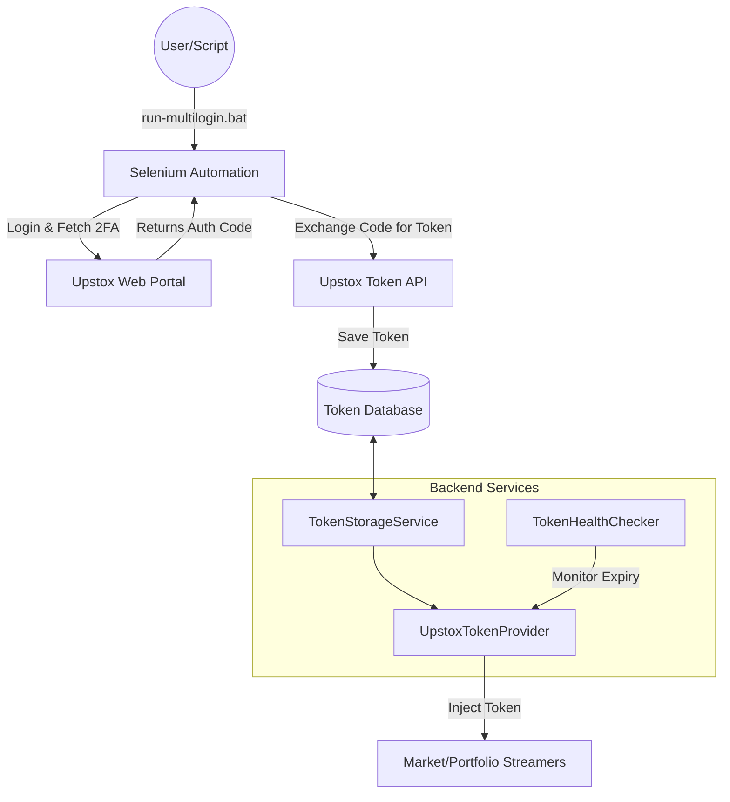

# Core Infrastructure & Authentication Report

This report covers the foundational elements of the Vega Trader backend, specifically the **System entry points**, **Authentication Architecture**, and **Token Management** systems.

## 1. Core System Architecture

### 🏗️ Module Overview
The Core module handles application startup, dependency injection (Spring Boot), and the centralized orchestration of services.

### 📂 File Structure
```text
src/main/java/com/vegatrader/
├── VegaTraderApplication.java       # Main entry point (Spring Boot)
└── config/                          # Application Configuration
    └── WebSocketConfig.java         # Global WebSocket Configuration
```

### 🧠 Functional Description
*   **VegaTraderApplication**: Bootstraps the Spring context, initializes schedulers, and ensures all dependent services (TokenProviders, Streamers) are instantiated.
*   **WebSocketConfig**: Configures the underlying WebSocket engine used by the streamers.

---

## 2. Authentication & Token Management

### 🏗️ Module Overview
This is a critical module responsible for **Multi-User Authentication**, **Token Lifecycle Management**, and **Automated Login** via Selenium. It ensures that the trading engine always has valid access tokens without manual intervention.

### 🔮 Architecture Diagram


### 📂 File Structure
```text
src/main/java/com/vegatrader/upstox/auth/
├── selenium/                        # Login Automation
│   ├── UpstoxLoginAutomator.java    # Main Selenium Script
│   └── WebDriverFactory.java        # Chrome Driver management
├── service/
│   ├── TokenStorageService.java     # DB Persistence Layer (SQLite/H2)
│   └── TokenLeaseManager.java       # Lease handling for multi-process access
├── controller/
│   └── AuthController.java          # REST Endpoints for manual token ops
└── entity/
    └── UpstoxTokenEntity.java       # Database Entity for Tokens
```

### 📂 Service Layer (`com.vegatrader.service`)
```text
src/main/java/com/vegatrader/service/
├── UpstoxTokenProvider.java         # Main Provider class consumed by app
├── UpstoxTokenHealthChecker.java    # Scheduled task to check validity
└── TokenHealth.java                 # Health status DTO
```

### 🧠 Functional Breakdown

#### A. Automated Login (`auth/selenium`)
*   **Functionality**: Uses Selenium WebDriver to launch a headless Chrome instance, navigate to Upstox login, simulates user input (or waits for manual OTP), captures the redirect URL, extracts the `code`, and invokes the Token API.
*   **Output**: A valid Access Token stored in the Database.

#### B. Persistence Layer (`auth/service/TokenStorageService`)
*   **Functionality**: Acts as the interface to the Database (SQLite/H2). It supports multiple APIs (denoted as `API_0`, `API_1`, etc.) to allow multi-account or multi-app setups.
*   **Key Methods**: `saveToken()`, `getToken(apiName)`, `getLatestToken()`.

#### C. Token Provider (`service/UpstoxTokenProvider`)
*   **Functionality**: The high-level service used by `MarketDataStreamer` and `PortfolioStreamer`. It abstracts away the database.
*   **Smart Selection**: It can select the "best" available token if multiple are present using a fallback strategy.
*   **Freshness Check**: Implements `isFreshEnough()` to warn or prevent usage of stale tokens for critical connections.

#### D. Health Monitoring (`service/UpstoxTokenHealthChecker`)
*   **Functionality**: Runs periodically to check if active tokens are nearing expiry (e.g., < 10 mins). It logs warnings or triggers refresh flows (if refresh tokens are supported/enabled).

---

## 3. Implementation Status

| Component | Status | Verification Notes |
| :--- | :--- | :--- |
| **Selenium Automator** | ✅ **TESTED** | `run-multilogin.bat` script is functional. |
| **Token Database** | ✅ **TESTED** | SQLite integration verified. |
| **Token Provider** | ✅ **TESTED** | Used successfully in `StreamerLiveTest`. |
| **Health Checker** | ✅ **TESTED** | Logs warnings correctly for stale tokens. |
