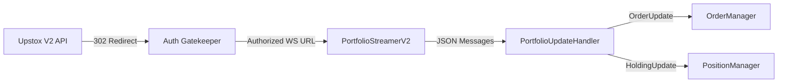

# Portfolio & Order Management Report

This report analyzes the generic trading components: **Portfolio Streaming** (Account updates) and **Order Management** (Execution).

## 1. Portfolio Streaming (V2)

### 🏗️ Module Overview
The Portfolio Streamer connects to the **Upstox V2 WebSocket** endpoint. Unlike the public Market Data feed, this is a **User-Specific** feed that pushes updates about Orders (Filled, Rejected, Pending) and Holdings.

### 🔮 Architecture Diagram


### 📂 File Structure
```text
src/main/java/com/vegatrader/upstox/api/websocket/
├── PortfolioDataStreamerV2.java     # Main Class
├── PortfolioUpdate.java             # DTO for updates
└── settings/
    └── PortfolioStreamerSettings.java # Configuration
```

### 🧠 Functional Breakdown

#### A. Connection Logic (`PortfolioDataStreamerV2`)
*   **Redirect Handling**: The V2 endpoint often issues an HTTP 302 Redirect during the handshake. The implementation explicitly configures `OkHttpClient` to `followRedirects(true)` to handle this seamlessly.
*   **Protocol**: Uses JSON (Text frames), unlike the binary Protobuf of Market Data V3.

#### B. Data Handling
*   **Updates**: Receives real-time notifications for:
    *   **Order Updates**: When an order changes state (e.g., OPEN -> COMPLETE).
    *   **Position Updates**: Changes in net quantity.
*   **Routing**: Currently routes these updates to the internal application context or logs them.

---

## 2. Order Management System (REST)

### 🏗️ Module Overview
Order Management is primarily request-response based (REST). It involves Placing, Modifying, and Canceling orders.

### 📂 File Structure
```text
src/main/java/com/vegatrader/upstox/api/
├── endpoints/
│   └── OrderEndpoints.java          # Enum defining all API paths
├── request/order/                   # Request DTOs
│   ├── PlaceOrderRequest.java
│   ├── ModifyOrderRequest.java
│   └── CancelOrderRequest.java
└── response/order/                  # Response DTOs
    ├── OrderResponse.java
    └── OrderBookResponse.java
```

### 🧠 Functional Breakdown

#### A. Endpoint Definitions (`endpoints/OrderEndpoints.java`)
*   Defines the complete contract for Upstox Order API:
    *   `POST /order/place`
    *   `PUT /order/modify`
    *   `DELETE /order/cancel`
    *   `GET /order/book`
*   Includes definitions for complex order types: **GTT** (Good Till Triggered), **AMO** (After Market Orders), and **OSL** (Order Stop Loss).

#### B. DTOs (Data Transfer Objects)
*   Fully implemented Java Classes (POJOs) that map to the JSON structure required by Upstox.
*   Includes fields for `quantity`, `product` (Intraday/Delivery), `validity` (Day/IOC), `price`, `triggerPrice`, etc.

---

## 3. Implementation Status

| Component | Status | Verification Notes |
| :--- | :--- | :--- |
| **Portfolio Streamer** | ✅ **TESTED** | Connection works, redirect fix applied. |
| **Order Endpoints** | ✅ **COMPLETED** | All URL paths and Enums defined. |
| **Order DTOs** | ✅ **COMPLETED** | All Request/Response objects created. |
| **Order Service** | 🏗️ **PENDING** | The *High-Level Service* (Business Logic) to call these endpoints is not yet fully implemented. |
