# Instruments Module - Architecture Diagrams

## Complete System Architecture

---

## Order Validation Flow

---

## Database Entity Relationships

---

## Client Risk Evaluation

```mermaid
flowchart TD
    START([Order Request]) --> CHECK_ENABLED{Trading<br/>Enabled?}
    
    CHECK_ENABLED -->|No| REJECT_DISABLED[❌ CLIENT_DISABLED]
    CHECK_ENABLED -->|Yes| CHECK_ORDER_VALUE{Order Value<br/>≤ Limit?}
    
    CHECK_ORDER_VALUE -->|No| REJECT_ORDER[❌ ORDER_VALUE_LIMIT]
    CHECK_ORDER_VALUE -->|Yes| CHECK_GROSS{Gross Exposure<br/>≤ Limit?}
    
    CHECK_GROSS -->|No| REJECT_GROSS[❌ GROSS_EXPOSURE_LIMIT]
    CHECK_GROSS -->|Yes| CHECK_NET{Net Exposure<br/>≤ Limit?}
    
    CHECK_NET -->|No| REJECT_NET[❌ NET_EXPOSURE_LIMIT]
    CHECK_NET -->|Yes| CHECK_TURNOVER{Turnover<br/>≤ Limit?}
    
    CHECK_TURNOVER -->|No| REJECT_TURNOVER[❌ TURNOVER_LIMIT]
    CHECK_TURNOVER -->|Yes| CHECK_POSITIONS{Positions<br/>≤ Limit?}
    
    CHECK_POSITIONS -->|No| REJECT_POS[❌ POSITION_COUNT_LIMIT]
    CHECK_POSITIONS -->|Yes| CHECK_LOSS{Intraday Loss<br/>≤ Limit?}
    
    CHECK_LOSS -->|No| REJECT_LOSS[❌ MAX_LOSS_HIT]
    CHECK_LOSS -->|Yes| APPROVE([✅ Order Approved])

    style REJECT_DISABLED fill:#ffcccc
    style REJECT_ORDER fill:#ffcccc
    style REJECT_GROSS fill:#ffcccc
    style REJECT_NET fill:#ffcccc
    style REJECT_TURNOVER fill:#ffcccc
    style REJECT_POS fill:#ffcccc
    style REJECT_LOSS fill:#ffcccc
    style APPROVE fill:#ccffcc
```

---

## Product Eligibility Decision Tree

```mermaid
flowchart TD
    START([Check Instrument]) --> EXISTS{Instrument<br/>Exists?}
    
    EXISTS -->|No| BLOCKED_NOTFOUND[🚫 blocked: NOT_FOUND]
    EXISTS -->|Yes| CHECK_PCA{On PCA<br/>Watchlist?}
    
    CHECK_PCA -->|Yes| CNC_PCA[📋 cncOnly: PCA]
    CHECK_PCA -->|No| CHECK_ASM{On ASM/GSM<br/>Watchlist?}
    
    CHECK_ASM -->|Yes| CNC_SURVEILLANCE[📋 cncOnly: SURVEILLANCE]
    CHECK_ASM -->|No| CHECK_T2T{Trade-for-Trade<br/>Series?}
    
    CHECK_T2T -->|Yes| CNC_T2T[📋 cncOnly: T2T]
    CHECK_T2T -->|No| CHECK_IPO{IPO<br/>Listing Day?}
    
    CHECK_IPO -->|Yes| CNC_IPO[📋 cncOnly: IPO_DAY0]
    CHECK_IPO -->|No| CHECK_SME{SME<br/>Security?}
    
    CHECK_SME -->|Yes| CNC_SME[📋 cncOnly: SME]
    CHECK_SME -->|No| NORMAL[✅ normal: ALL_ALLOWED]

    style BLOCKED_NOTFOUND fill:#ff9999
    style CNC_PCA fill:#ffffcc
    style CNC_SURVEILLANCE fill:#ffffcc
    style CNC_T2T fill:#ffffcc
    style CNC_IPO fill:#ffffcc
    style CNC_SME fill:#ffffcc
    style NORMAL fill:#99ff99
```

