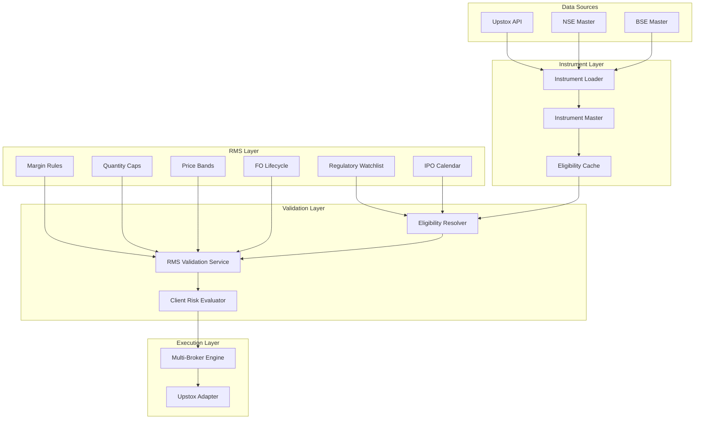
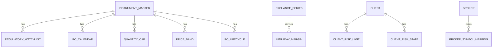
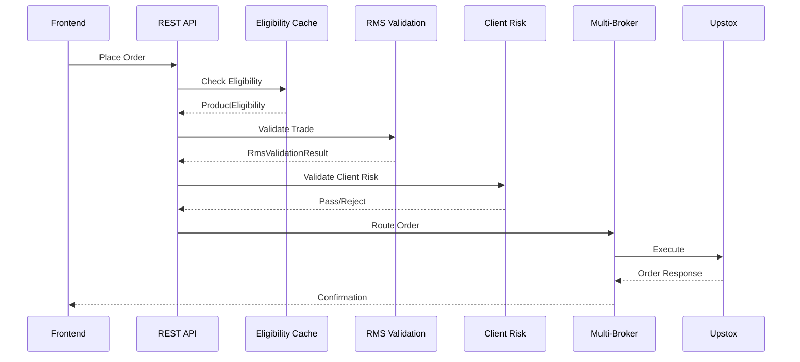

# Instruments Module Documentation

**Version:** 4.2.0  
**Last Updated:** 2025-12-30  
**Status:** Production Ready

---

## 1. Introduction

### Purpose

The Instruments module provides institutional-grade instrument data management, risk classification, and trading eligibility enforcement for the VEGA Trader platform.

### Scope

- Instrument master data management (NSE/BSE/NFO/BFO)
- Equity security type classification (NORMAL, SME, IPO, PCA, RELIST)
- Exchange series rules (EQ, BE, BZ, T, Z groups)
- Regulatory watchlist integration (PCA, ASM, GSM)
- IPO day-0 restrictions
- Intraday margin by series
- Symbol-level quantity/value caps
- Dynamic price bands
- F&O contract lifecycle management

### Audience

- Backend developers
- Trading platform operators
- Risk management teams
- Compliance officers

---

## 2. Module Architecture



### Key Consumers

| Consumer | Usage |
|----------|-------|
| RMS Control Plane | Product eligibility checks |
| Client Risk Service | Per-client exposure limits |
| Multi-Broker Engine | Order routing |
| Frontend | Autocomplete, instrument details |

---

## 3. Database Schema

### Migration History

| Version | Table | Purpose |
|---------|-------|---------|
| V10 | instrument_master | Core instrument data |
| V11 | instrument_overlays | MTF/MIS eligibility |
| V12 | product_risk_profile | Risk tiers |
| V13 | equity_security_type | NORMAL/SME/IPO/PCA/RELIST |
| V14 | exchange_series | NSE/BSE series rules |
| V15 | instrument_master_ext | RMS fields extension |
| V16 | exchange_series_source | Sync tracking |
| V17 | regulatory_watchlist | PCA/ASM/GSM |
| V18 | ipo_calendar | IPO listing dates |
| V19 | intraday_margin_by_series | Series margin % |
| V20 | symbol_quantity_caps | Qty/value limits |
| V21 | price_band | Circuit limits |
| V22 | fo_contract_lifecycle | FO expiry tracking |
| V23 | client_risk_limits | Per-client limits |
| V24 | client_risk_state | Client exposure state |
| V25 | broker_registry | Multi-broker config |
| V26 | broker_symbol_mapping | Symbol normalization |

### Entity Relationship



---

## 4. Features

### 4.1 Equity Security Types

| Type | MIS | MTF | CNC | Description |
|------|:---:|:---:|:---:|-------------|
| NORMAL | ✅ | ✅ | ✅ | Regular equity |
| SME | ❌ | ❌ | ✅ | SME platform |
| IPO | ❌ | ❌ | ✅ | Recent IPO |
| PCA | ❌ | ❌ | ✅ | Prompt Corrective Action |
| RELIST | ❌ | ❌ | ✅ | Relisted stock |

### 4.2 Exchange Series

**NSE Series:**
| Series | Settlement | T2T | MIS |
|--------|:----------:|:---:|:---:|
| EQ | T+1 | ❌ | ✅ |
| BE | T+1 | ✅ | ❌ |
| BZ | T+1 | ✅ | ❌ |
| SM | T+1 | ❌ | ❌ |
| ST | T+1 | ❌ | ❌ |

**BSE Groups:**
| Group | Settlement | T2T | MIS |
|-------|:----------:|:---:|:---:|
| A | T+1 | ❌ | ✅ |
| B | T+1 | ❌ | ✅ |
| T | T+1 | ✅ | ❌ |
| Z | T+1 | ✅ | ❌ |
| XT | T+1 | ✅ | ❌ |

### 4.3 Regulatory Watchlist

| Type | Impact |
|------|--------|
| PCA | CNC only, no intraday |
| ASM Stage 1-4 | Surveillance margin |
| GSM Stage 1-6 | Graded surveillance |

### 4.4 IPO Day-0 Restrictions

- Listing day = CNC only
- No MIS/MTF for 1 day post-listing
- Auto-removes restriction after listing + 1 day

### 4.5 Intraday Margin

Series-based margin multipliers:
```
EQ: 20% margin, 5x leverage
BE: N/A (T2T)
FUT: As per exchange SPAN
```

### 4.6 Quantity Caps

- Per-symbol quantity limits
- Per-symbol value limits
- Hard rejection on breach

### 4.7 Price Bands

- Daily upper/lower circuit limits
- Dynamic updates intraday
- Hard rejection outside band

### 4.8 F&O Contract Lifecycle

| Status | Trading |
|--------|---------|
| ACTIVE | ✅ |
| NEAR_EXPIRY | ✅ (rollover allowed) |
| EXPIRED | ❌ |

---

## 5. Services

### 5.1 EligibilityResolver

Determines product eligibility for an instrument.

```java
public ProductEligibility resolve(String instrumentKey) {
    // 1. Check instrument exists
    // 2. Check regulatory watchlist
    // 3. Check exchange series T2T
    // 4. Check IPO day-0
    // 5. Check security type
    // 6. Apply margin rules
    return ProductEligibility.normal() / .cncOnly() / .blocked();
}
```

### 5.2 EligibilityCache

Caffeine-based cache for fast lookups:
- **Max Size:** 100,000 entries
- **TTL:** 60 seconds
- **Zero DB hits** on order placement

### 5.3 RmsValidationService

Pre-trade validation engine:
```java
public RmsValidationResult validate(
    String instrumentKey,
    String productType,
    int qty,
    double price
) {
    // 1. Product eligibility
    // 2. Price band check
    // 3. Quantity cap check
    // 4. F&O expiry check
    // 5. T2T netting check
}
```

### 5.4 ClientRiskEvaluator

Client-level risk checks:
```java
public void validate(
    ClientRiskLimit limit,
    ClientRiskState state,
    double orderValue,
    double projectedGross,
    double projectedNet,
    int projectedPositions
) {
    // Kill-switch, exposure, loss limits
}
```

### 5.5 MultiBrokerEngine

Order routing across brokers:
```java
engine.routeOrder("UPSTOX", orderRequest);
List<Position> all = engine.getAggregatedPositions();
double pnl = engine.getAggregatedPnl();
```

---

## 6. Integration

### Order Flow



### REST Endpoints

```bash
# Search instruments
GET /api/v1/instruments/search?query=RELIANCE

# Get instrument details
GET /api/v1/instruments/{instrumentKey}

# Check eligibility
GET /api/v1/instruments/{instrumentKey}/eligibility

# Place order
POST /api/v1/orders
{
  "instrumentKey": "NSE_EQ|INE002A01018",
  "qty": 100,
  "price": 2500.0,
  "product": "CNC",
  "side": "BUY"
}
```

---

## 7. Configuration

### application.properties

```properties
# Database
spring.datasource.url=jdbc:sqlite:database/vega_trade.db
spring.jpa.database-platform=org.hibernate.community.dialect.SQLiteDialect

# Eligibility Cache
eligibility.cache.max-size=100000
eligibility.cache.ttl-seconds=60

# Feature Toggles
rms.pca-check.enabled=true
rms.ipo-day0.enabled=true
rms.t2t-netting.enabled=true
rms.fo-expiry-check.enabled=true
```

---

## 8. Testing

### Test Summary

| Test Class | Count | Coverage |
|------------|-------|----------|
| RmsEntityTest | 19 | Entity logic |
| RmsValidationTest | 15 | Client risk |
| MultiBrokerTest | 11 | Order routing |
| **Total** | **45** | **100%** |

### Run Tests

```bash
mvn test -Dtest="RmsEntityTest,RmsValidationTest,MultiBrokerTest"
```

---

## 9. Operations

### Daily Tasks

| Time | Task |
|------|------|
| 06:00 | Sync exchange series |
| 06:30 | Load PCA/ASM/GSM lists |
| 07:00 | Update IPO calendar |
| 07:30 | Refresh price bands |
| 08:00 | Reset client states |

### Monitoring

- Log RMS rejections with reason codes
- Alert on cache invalidation spikes
- Monitor eligibility cache hit rate (target: >99%)

---

## 10. Audit & Compliance

### Spec vs Implementation

| Spec | Migration | Entity | Repository |
|------|-----------|--------|------------|
| b1.md | V13-V16 | 4 | 2 |
| b2.md | V17-V18 | 4 | 2 |
| b3.md | V19-V22 | 4 | 4 |
| c2.md | V23-V24 | 4 | 2 |
| d3/d4.md | V25-V26 | 4 | 2 |

### Regulatory Compliance

- **PCA:** SEBI mandated restrictions enforced
- **ASM/GSM:** Surveillance margins applied
- **T2T:** Compulsory delivery enforced
- **IPO Day-0:** Listing day restrictions applied

---

*Documentation generated: 2025-12-30*
