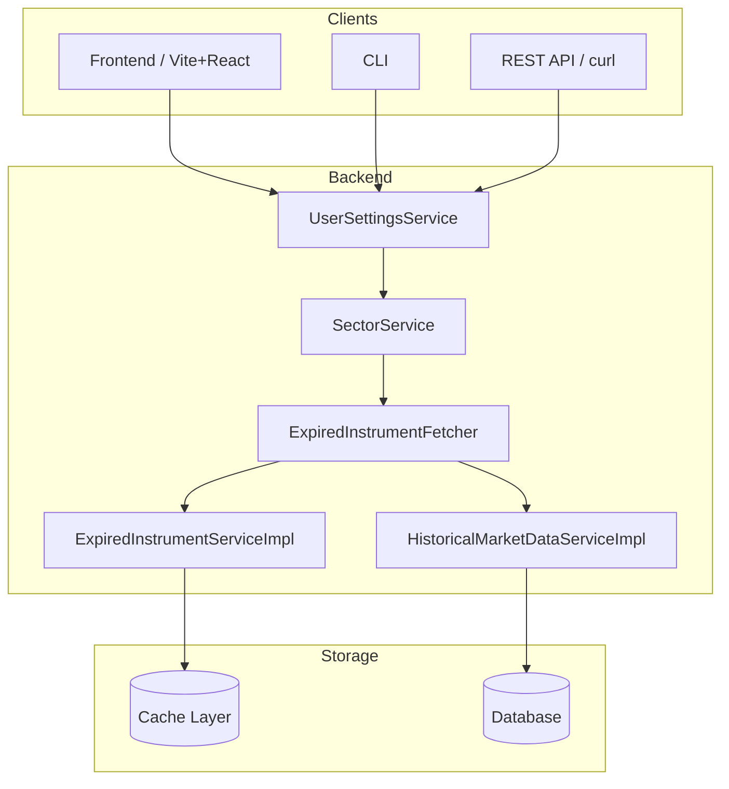
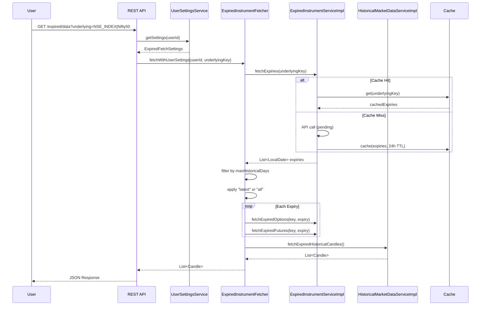
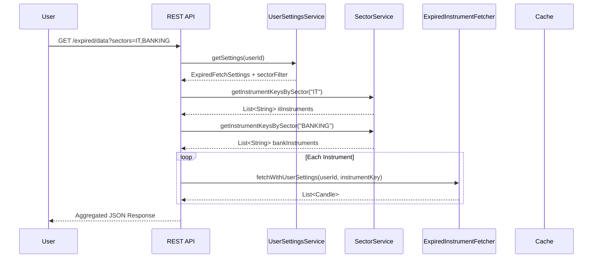
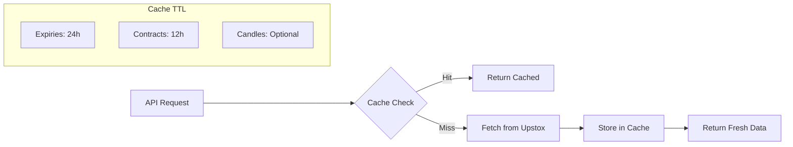

# Expired Instruments - Flow & Sequence Diagrams

**Based on:** c1.md specification

---

## 1. High-Level Architecture

---

## 2. Single Instrument Request Flow

---

## 3. Multi-Sector Batch Request

---

## 4. REST API Endpoints

| Endpoint | Method | Description |
|----------|--------|-------------|
| `/api/v1/expired/expiries` | GET | Get expiry dates for underlying |
| `/api/v1/expired/options` | GET | Get expired option contracts |
| `/api/v1/expired/futures` | GET | Get expired future contracts |
| `/api/v1/expired/candles` | GET | Get historical candles |
| `/api/v1/expired/data` | GET | Full fetch with user settings |
| `/api/v1/expired/intervals` | GET | Get supported intervals |
| `/api/v1/expired/validate` | GET | Validate key format |

---

## 5. User Settings Integration

| Setting | Effect |
|---------|--------|
| `expired.default_expiry_fetch` | "latest" = most recent, "all" = full history |
| `expired.default_instrument_type` | "options", "futures", or "both" |
| `expired.default_interval` | Candle interval (1min, 5min, day) |
| `expired.max_historical_days` | Limit history depth |
| `expired.show_weekly_options` | Include/exclude weekly expiries |
| `expired.auto_cache_expiries` | Enable 24h expiry caching |

---

## 6. Caching Strategy

---

*Generated: 2025-12-30*
