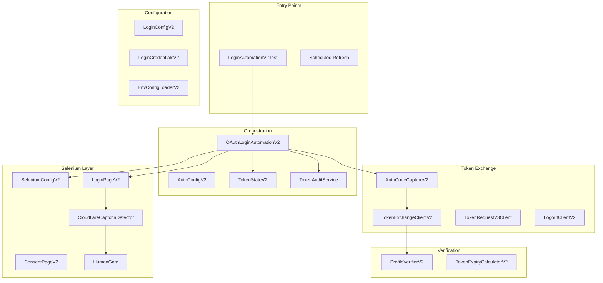
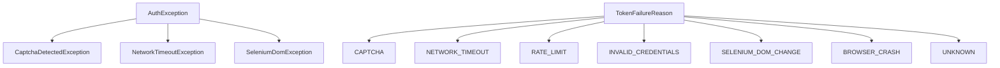
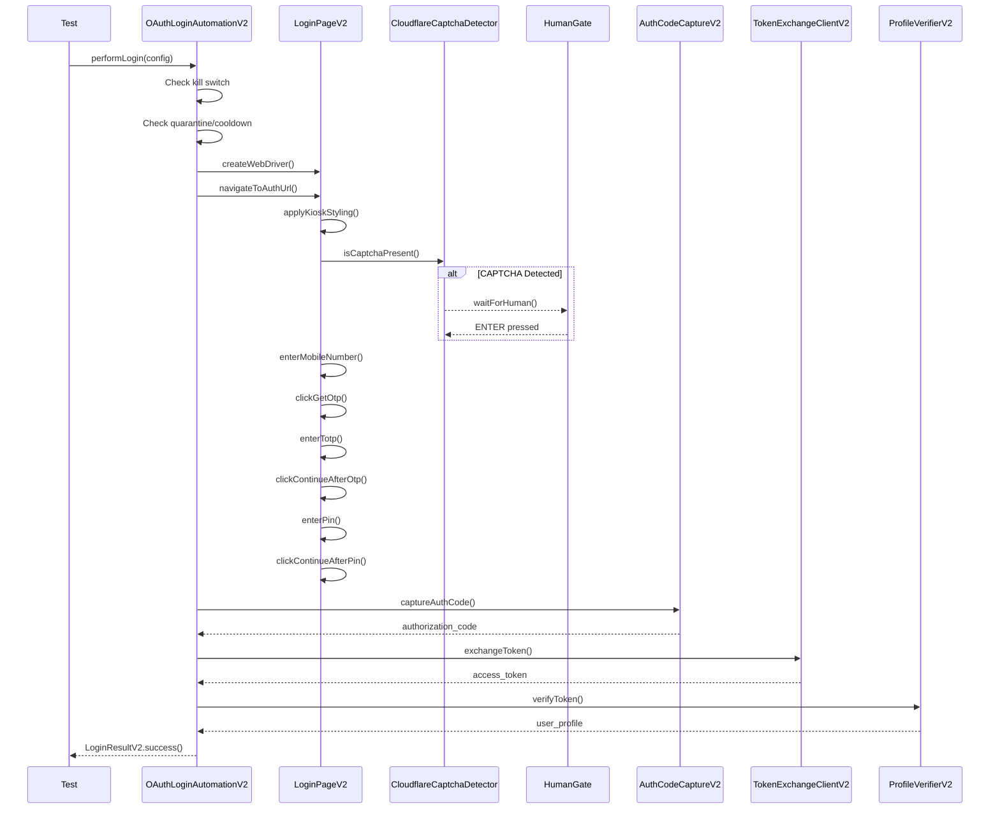

# Upstox V2 Enterprise Login Automation - Complete Documentation

## Executive Summary

Enterprise-grade Selenium-based OAuth login automation for Upstox trading platform. Supports 6 API keys with CAPTCHA pause/resume, token quarantine, audit logging, and v3 fallback.

---

## Architecture Overview



---

## Package Structure

```
com.vegatrader.upstox.auth.selenium.v2/
├── OAuthLoginAutomationV2.java      # Main orchestrator
├── LoginPageV2.java                 # Selenium page object
├── ConsentPageV2.java               # OAuth consent handling
├── AuthCodeCaptureV2.java           # Auth code extraction
├── TokenExchangeClientV2.java       # Code → Token API
├── TokenRequestV3Client.java        # v3 fallback flow
├── ProfileVerifierV2.java           # Token validation
├── LogoutClientV2.java              # Token invalidation
├── LoginConfigV2.java               # Config DTO + builder
├── LoginCredentialsV2.java          # Credentials + TOTP
├── LoginResultV2.java               # Result DTO
├── SeleniumConfigV2.java            # WebDriver factory
├── EnvConfigLoaderV2.java           # .env file loader
├── TokenExpiryCalculatorV2.java     # 3:30 AM expiry logic
├── TokenStateV2.java                # Quarantine/cooldown
├── TokenAuditService.java           # Event logging
├── AuthConfigV2.java                # Enterprise config
├── LoginAutomationV2Test.java       # Integration test
├── control/
│   └── HumanGate.java               # Pause/resume
├── security/
│   └── CloudflareCaptchaDetector.java  # CAPTCHA detection
└── exception/
    ├── TokenFailureReason.java      # Failure taxonomy
    ├── AuthException.java           # Base exception
    ├── CaptchaDetectedException.java # CAPTCHA abort
    ├── NetworkTimeoutException.java # Retryable
    └── SeleniumDomException.java    # DOM changes
```

---

## Component Details

### 1. Entry Point & Orchestration

#### [OAuthLoginAutomationV2.java](file:///d:/projects/VEGA%20TRADER/backend/java/vega-trader/src/main/java/com/vegatrader/upstox/auth/selenium/v2/OAuthLoginAutomationV2.java)

**Purpose:** Main orchestrator coordinating the complete OAuth flow.

| Feature | Description |
|---------|-------------|
| Kill Switch | `AuthConfigV2.seleniumEnabled` check |
| Quarantine | Blocks regeneration if token quarantined |
| Cooldown | Enforces 15-min wait after failure |
| Failure Classification | Maps exceptions to `TokenFailureReason` |
| Screenshot | Captures on failure with reason in filename |

**Flow:**
1. Check kill switch
2. Check quarantine/cooldown
3. Create WebDriver
4. Navigate to auth URL
5. Perform login (mobile → OTP → TOTP → PIN)
6. Capture auth code
7. Exchange for token
8. Verify profile
9. Log audit event

---

### 2. Selenium Layer

#### [LoginPageV2.java](file:///d:/projects/VEGA%20TRADER/backend/java/vega-trader/src/main/java/com/vegatrader/upstox/auth/selenium/v2/LoginPageV2.java)

**Purpose:** Page Object for Upstox login with CAPTCHA handling.

| XPath Selector | Element |
|----------------|---------|
| `//*[@id='mobileNum']` | Mobile input |
| `//*[@id='getOtp']` | Get OTP button |
| `//*[@id='otpNum']` | OTP/TOTP input |
| `//*[@id='continueBtn']` | Continue button |
| `//*[@id='pinCode']` | PIN input |
| `//*[@id='pinContinueBtn']` | PIN continue |

**Kiosk Mode:**
- Window size: 888x382
- Hides QR code section
- Removes help links
- Focused login display

#### [SeleniumConfigV2.java](file:///d:/projects/VEGA%20TRADER/backend/java/vega-trader/src/main/java/com/vegatrader/upstox/auth/selenium/v2/SeleniumConfigV2.java)

**Chrome Options:**
```
--window-size=888,382
--window-position=100,100
--app=data:text/html,Loading...  (no address bar)
--disable-blink-features=AutomationControlled
```

---

### 3. CAPTCHA Handling

#### [CloudflareCaptchaDetector.java](file:///d:/projects/VEGA%20TRADER/backend/java/vega-trader/src/main/java/com/vegatrader/upstox/auth/selenium/v2/security/CloudflareCaptchaDetector.java)

**Detection Methods:**
1. Cloudflare iframe (`challenges.cloudflare.com`)
2. DOM markers (`[id*='cf']`, `.cf-turnstile`)
3. Error text ("Error", "Having trouble?")
4. Disabled Get OTP button with Turnstile present

**Fail-Safe:** If detection fails → assume CAPTCHA exists

#### [HumanGate.java](file:///d:/projects/VEGA%20TRADER/backend/java/vega-trader/src/main/java/com/vegatrader/upstox/auth/selenium/v2/control/HumanGate.java)

**Methods:**
- `waitForHuman(reason)` - Blocks until ENTER
- `waitForHumanWithTimeout(reason, seconds)` - Auto-continue option
- `notifyHuman(reason)` - Non-blocking alert

---

### 4. Token Exchange

#### [AuthCodeCaptureV2.java](file:///d:/projects/VEGA%20TRADER/backend/java/vega-trader/src/main/java/com/vegatrader/upstox/auth/selenium/v2/AuthCodeCaptureV2.java)

**Features:**
- Polls for redirect to callback URI
- State validation (CSRF protection)
- Error extraction from URL
- 120-second timeout

#### [TokenExchangeClientV2.java](file:///d:/projects/VEGA%20TRADER/backend/java/vega-trader/src/main/java/com/vegatrader/upstox/auth/selenium/v2/TokenExchangeClientV2.java)

**Endpoint:** `POST /v2/login/authorization/token`

**Request:**
```
code=AUTH_CODE
client_id=CLIENT_ID
client_secret=CLIENT_SECRET
redirect_uri=REDIRECT_URI
grant_type=authorization_code
```

#### [TokenRequestV3Client.java](file:///d:/projects/VEGA%20TRADER/backend/java/vega-trader/src/main/java/com/vegatrader/upstox/auth/selenium/v2/TokenRequestV3Client.java)

**Fallback Flow (No Selenium):**
1. `POST /v3/login/auth/token/request/{client_id}`
2. User approves in Upstox app/WhatsApp
3. Token delivered via webhook

**Use When:** CAPTCHA loops, broker enforcement, compliance

---

### 5. Configuration

#### [LoginConfigV2.java](file:///d:/projects/VEGA%20TRADER/backend/java/vega-trader/src/main/java/com/vegatrader/upstox/auth/selenium/v2/LoginConfigV2.java)

| Field | Description |
|-------|-------------|
| `apiName` | PRIMARY, WEBSOCKET1-3, OPTIONCHAIN1-2 |
| `clientId` | Upstox API client ID |
| `clientSecret` | Upstox API secret |
| `redirectUri` | OAuth callback URI |
| `credentials` | Mobile, PIN, TOTP secret |
| `state` | Auto-generated CSRF token |

**Builder Pattern:**
```java
LoginConfigV2.builder()
    .apiName("PRIMARY")
    .clientId("xxx")
    .clientSecret("xxx")
    .redirectUri("http://localhost:28020/api/v1/auth/upstox/callback")
    .credentials(mobile, pin, totp)
    .headless(false)
    .build();
```

#### [EnvConfigLoaderV2.java](file:///d:/projects/VEGA%20TRADER/backend/java/vega-trader/src/main/java/com/vegatrader/upstox/auth/selenium/v2/EnvConfigLoaderV2.java)

**.env Keys:**
```
UPSTOX_MOBILE_NUMBER=9599130381
UPSTOX_PIN=******
UPSTOX_TOTP=<base32_secret>
UPSTOX_CLIENT_ID_0=xxx
UPSTOX_CLIENT_SECRET_0=xxx
UPSTOX_REDIRECT_URI=http://localhost:28020/api/v1/auth/upstox/callback
```

---

### 6. Enterprise Features

#### [TokenStateV2.java](file:///d:/projects/VEGA%20TRADER/backend/java/vega-trader/src/main/java/com/vegatrader/upstox/auth/selenium/v2/TokenStateV2.java)

| Feature | Default |
|---------|---------|
| Quarantine | Manual or 3 consecutive failures |
| Cooldown | 15 minutes after failure |
| Auto-quarantine | On CAPTCHA detection |

#### [TokenAuditService.java](file:///d:/projects/VEGA%20TRADER/backend/java/vega-trader/src/main/java/com/vegatrader/upstox/auth/selenium/v2/TokenAuditService.java)

**Events:**
- `GENERATED` - New token created
- `REFRESHED` - Token refreshed
- `FAILED` - Generation failed
- `QUARANTINED` - Token isolated
- `UNQUARANTINED` - Token restored
- `EXPIRED` - Token expired
- `VALIDATED` - Profile verified

---

### 7. Exception Taxonomy



| Reason | Retryable | Quarantine | Manual |
|--------|-----------|------------|--------|
| CAPTCHA | ❌ | ✅ | ✅ |
| NETWORK_TIMEOUT | ✅ | ❌ | ❌ |
| RATE_LIMIT | ✅ | ❌ | ❌ |
| INVALID_CREDENTIALS | ❌ | ✅ | ✅ |
| SELENIUM_DOM_CHANGE | ❌ | ❌ | ✅ |

---

## Login Flow Sequence



---

## API Endpoints Used

| Endpoint | Method | Purpose |
|----------|--------|---------|
| `/v2/login/authorization/dialog` | GET | OAuth authorize |
| `/v2/login/authorization/token` | POST | Code → Token |
| `/v3/login/auth/token/request/{id}` | POST | v3 fallback |
| `/v2/user/profile` | GET | Token verification |
| `/v2/logout` | DELETE | Token invalidation |

---

## Files Created

| File | Lines | Purpose |
|------|-------|---------|
| `OAuthLoginAutomationV2.java` | ~250 | Main orchestrator |
| `LoginPageV2.java` | ~475 | Selenium page object |
| `SeleniumConfigV2.java` | ~150 | WebDriver config |
| `CloudflareCaptchaDetector.java` | ~130 | CAPTCHA detection |
| `HumanGate.java` | ~130 | Pause/resume control |
| `TokenRequestV3Client.java` | ~180 | v3 fallback |
| `LogoutClientV2.java` | ~85 | Token logout |
| `TokenStateV2.java` | ~120 | State management |
| `TokenAuditService.java` | ~115 | Audit logging |
| **Total** | **~1800** | Enterprise auth module |

---

## Running the Test

```powershell
cd d:\projects\VEGA TRADER\backend\java\vega-trader
mvn compile exec:java "-Dexec.mainClass=com.vegatrader.upstox.auth.selenium.v2.LoginAutomationV2Test" 2>&1 | Tee-Object -FilePath "d:\projects\VEGA TRADER\prompt\modules\auth\test-log\login_test_$(Get-Date -Format 'yyyyMMdd_HHmmss').log"
```

---

## Security Considerations

| Rule | Implementation |
|------|----------------|
| No CAPTCHA bypass | CAPTCHA → ABORT + QUARANTINE |
| PIN never logged | Masked in all outputs |
| TOTP secret encrypted | Loaded from .env only |
| State validation | CSRF protection on redirect |
| Code single-use | Exchange immediately |
| Token expires 3:30 AM | `TokenExpiryCalculatorV2` |
