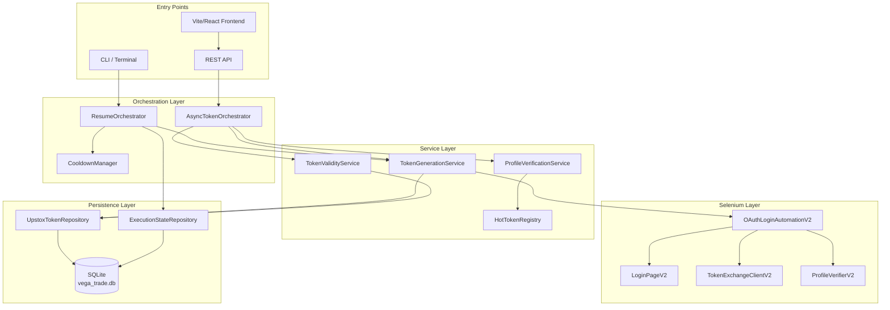

# Architecture Overview

## 1. Component Diagram



---

## 2. Design Principles

### 2.1 Compliance First
- **No CAPTCHA bypass** - Human-in-the-loop for all CAPTCHA
- **No OTP abuse** - Single Selenium instance, no parallel logins
- **Audit trail** - All token events logged

### 2.2 Fail Fast
- No retries on OTP/PIN failures
- Immediate cooldown on broker throttling
- No silent regeneration

### 2.3 Human-in-the-Loop
- Operator confirmation for generation
- Visual browser for credential entry
- Clear success/failure feedback

### 2.4 Single Source of Truth
- SQLite database is authoritative
- In-memory cache (HotTokenRegistry) is secondary
- State persisted for crash recovery

### 2.5 Zero Unnecessary Regeneration
- Parallel profile verification before generation
- Fast-path exit if all tokens valid
- Only generate invalid/missing tokens

---

## 3. Component Responsibilities

### 3.1 Orchestration Layer

| Component | Responsibility |
|-----------|----------------|
| `ResumeOrchestrator` | Resume-from-failure, 11-min cooldown |
| `AsyncTokenOrchestrator` | Parallel verification, single Selenium |
| `CooldownManager` | Broker throttling detection & enforcement |

### 3.2 Service Layer

| Component | Responsibility |
|-----------|----------------|
| `TokenGenerationService` | Selenium login + DB persist |
| `TokenValidityService` | Time-based validation (3:30 AM IST) |
| `ProfileVerificationService` | API-based validation |
| `HotTokenRegistry` | In-memory zero-delay cache |

### 3.3 Selenium Layer

| Component | Responsibility |
|-----------|----------------|
| `OAuthLoginAutomationV2` | Full login flow orchestration |
| `LoginPageV2` | Page object for login elements |
| `TokenExchangeClientV2` | OAuth code → token exchange |
| `ProfileVerifierV2` | Profile API verification |

### 3.4 Persistence Layer

| Component | Responsibility |
|-----------|----------------|
| `UpstoxTokenRepository` | Token CRUD operations |
| `ExecutionStateRepository` | Resume state persistence |
| `SqliteDataSourceFactory` | Connection management |

---

## 4. Data Flow

### 4.1 Token Generation Flow

```
1. Load API configs from .env
2. Check existing tokens in DB
3. Parallel profile verification (6 threads)
4. Determine tokens to generate
5. Sequential Selenium login (1 browser)
6. Exchange auth code for token
7. Verify token via Profile API
8. Persist to database immediately
9. Update HotTokenRegistry
10. Return success to caller
```

### 4.2 Resume Flow

```
1. Load execution state from DB
2. Check if in cooldown
3. If cooldown → wait 11 minutes
4. Resume from last failed API
5. Continue sequential generation
6. Mark completed when done
```

---

## 5. Concurrency Model

| Component | Threads | Purpose |
|-----------|---------|---------|
| Profile Verification | 6 | Parallel API checks |
| Selenium Login | 1 | Single browser (broker-safe) |
| DB Operations | 1 | Thread-safe SQLite |

---

## 6. Error Handling Strategy

| Error Type | Action |
|------------|--------|
| Timeout on PIN/OTP | Trigger cooldown |
| CAPTCHA detected | Pause for human |
| Invalid credentials | Fail immediately |
| Profile API 401 | Mark token invalid |
| DB failure | Log and continue |

---

**Document Status:** Final  
**Last Updated:** 2025-12-29
