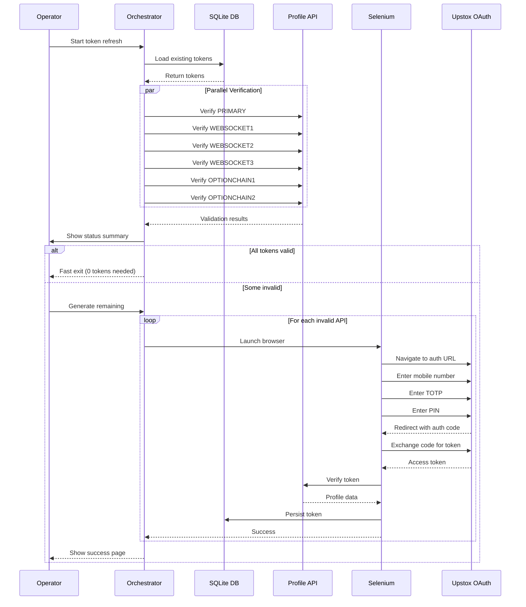

# Authentication Flow

## 1. Complete Flow Summary



---

## 2. Step-by-Step Flow

### Step 1: Load Configuration
```
Source: .env file
Load: 
  - UPSTOX_MOBILE_NUMBER
  - UPSTOX_TOTP (secret key)
  - UPSTOX_PIN
  - UPSTOX_CLIENT_ID_0..5
  - UPSTOX_CLIENT_SECRET_0..5
  - UPSTOX_REDIRECT_URI
```

### Step 2: Load Existing Tokens
```sql
SELECT * FROM upstox_tokens WHERE is_active = 1
```

### Step 3: Validate Timestamps
```java
// Token valid if:
// 1. validity_at > current_time
// 2. Token was generated today (before 3:30 AM IST next day)
```

### Step 4: Parallel Profile Verification
```
6 concurrent API calls to:
GET https://api.upstox.com/v2/user/profile
Header: Authorization: Bearer <token>

Result: HTTP 200 = valid, 401/403 = invalid
```

### Step 5: Present Token Status
```
═══════════════════════════════════════
        TOKEN STATUS SUMMARY
═══════════════════════════════════════
  PRIMARY         : ✓ VALID
  WEBSOCKET1      : ✓ VALID
  WEBSOCKET2      : ✗ EXPIRED
  WEBSOCKET3      : ✗ MISSING
  OPTIONCHAIN1    : ✓ VALID
  OPTIONCHAIN2    : ✗ INVALID
═══════════════════════════════════════
  Valid: 3 | Invalid: 2 | Missing: 1
═══════════════════════════════════════
```

### Step 6: User Action Selection
```
Choose:
[1] Generate remaining only (3 tokens)
[2] Regenerate all (6 tokens)
[3] Generate specific APIs
```

### Step 7: Selenium OAuth Login
```
For each API to generate:
1. Create Chrome WebDriver (kiosk mode 888x382)
2. Navigate to: https://api.upstox.com/v2/login/authorization/dialog
   ?client_id=<client_id>
   &redirect_uri=<redirect_uri>
   &response_type=code
3. Enter mobile number
4. Enter TOTP (auto-generated)
5. Enter PIN
6. Wait for redirect
7. Capture authorization code
```

### Step 8: Token Exchange
```http
POST https://api.upstox.com/v2/login/authorization/token
Content-Type: application/x-www-form-urlencoded

code=<auth_code>
&client_id=<client_id>
&client_secret=<client_secret>
&redirect_uri=<redirect_uri>
&grant_type=authorization_code
```

### Step 9: Profile Verification
```http
GET https://api.upstox.com/v2/user/profile
Authorization: Bearer <access_token>
Accept: application/json
```

### Step 10: Database Persistence
```sql
INSERT OR REPLACE INTO upstox_tokens (
    api_name, api_index, access_token, user_id, user_name,
    is_active, validity_at, generated_at
) VALUES (?, ?, ?, ?, ?, 1, ?, ?)
```

### Step 11: Success Page
```json
{
  "tokenInserted": true,
  "apiName": "PRIMARY",
  "tokenExpiry": "2025-12-30T03:30:00",
  "profile": {
    "userId": "7EAHBJ",
    "userName": "vijay kumar sharma",
    "broker": "UPSTOX",
    "exchanges": ["NSE","NFO","BSE","CDS","BFO","BCD"]
  }
}
```

---

## 3. Token Validity Rules

### 3.1 Daily Expiry
- Tokens expire at **3:30 AM IST next day**
- Regeneration window: 3:30 AM - 9:00 AM IST

### 3.2 Validity Calculation
```java
// Calculate token expiry
LocalDateTime now = LocalDateTime.now(ZoneId.of("Asia/Kolkata"));
LocalDateTime expiry;

if (now.toLocalTime().isBefore(LocalTime.of(3, 30))) {
    // Before 3:30 AM today → expires today 3:30 AM
    expiry = now.toLocalDate().atTime(3, 30);
} else {
    // After 3:30 AM today → expires tomorrow 3:30 AM
    expiry = now.toLocalDate().plusDays(1).atTime(3, 30);
}
```

---

## 4. Cooldown & Resume

### 4.1 Broker Throttling Detection
Triggered when:
- Timeout waiting for PIN submit
- Timeout waiting for redirect
- Authorization code not received

### 4.2 Cooldown Behavior
```
1. Stop Selenium immediately
2. Record failure state to DB
3. Wait 11 minutes (10 min broker limit + 1 min buffer)
4. Resume from exact failure point
5. Never regenerate successful tokens
```

---

**Document Status:** Final  
**Last Updated:** 2025-12-29
