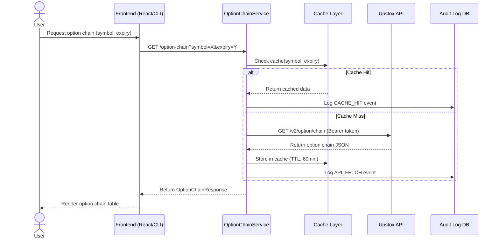
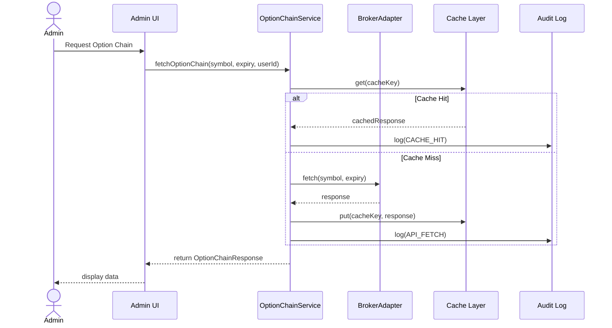
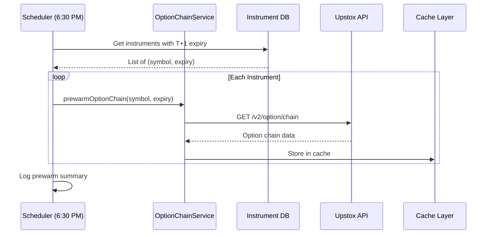
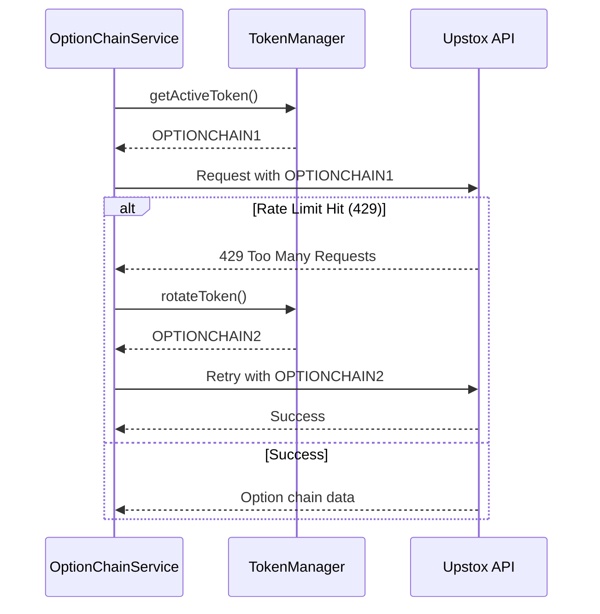
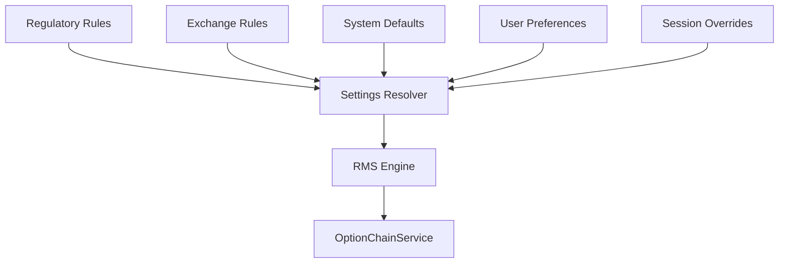

# Option Chain Module - Sequence Diagrams

**Version:** 1.0  
**Last Updated:** 2025-12-30

---

## 1. Option Chain Fetch Flow

---

## 2. Admin Fetch Flow

---

## 3. T-1 Pre-warm Scheduler

---

## 4. Token Rotation Flow

---

## 5. Settings Resolution Flow

---

*Document Status: FINALIZED*
