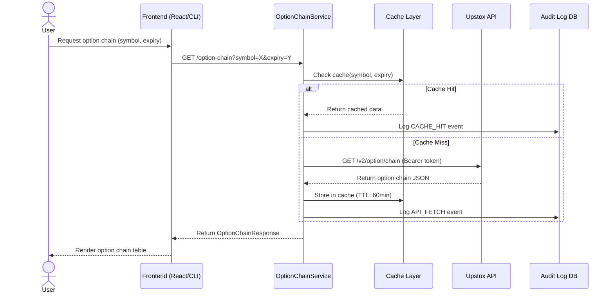
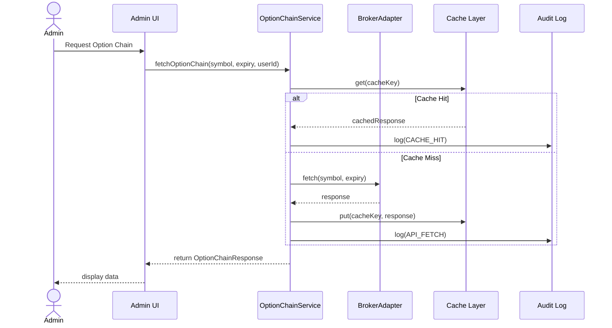
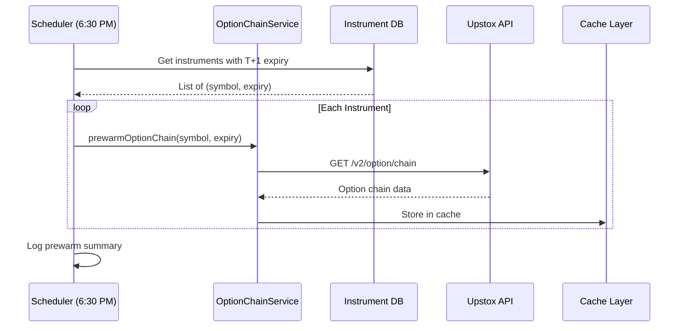
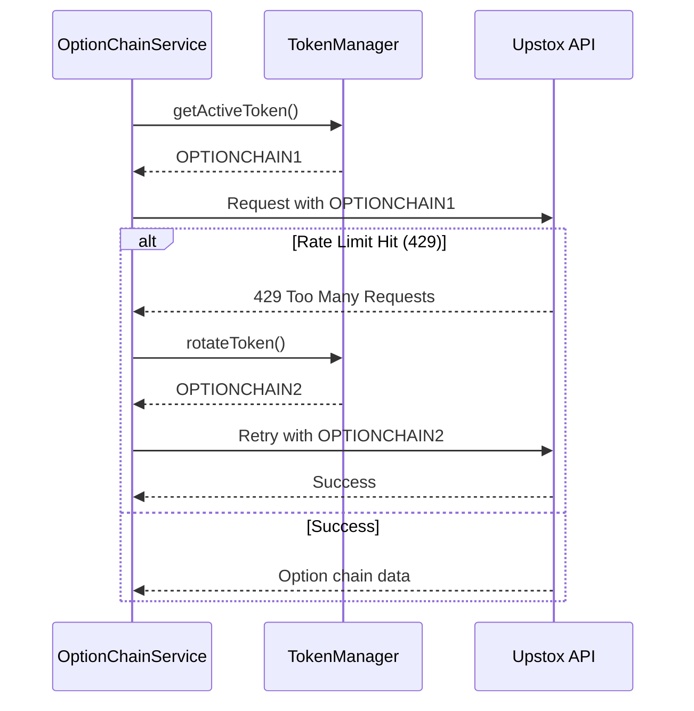
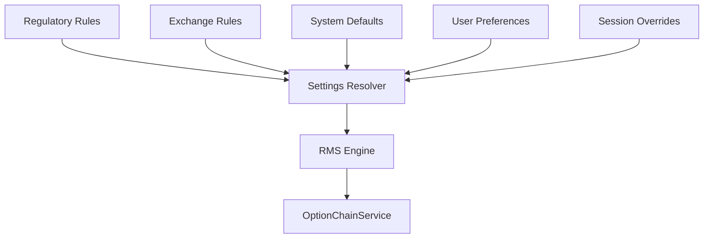

create testing guide to test live response getting from the option chain, log these response "@prompt\optionchain\testing\log", test all modules that belongs to it. give me a complete guide to test the option chain every features.

# RMS Control Plane v4.1 - Task Checklist

## Phase A: Database Schema (Flyway V13-V22) ✅
- [x] V13 - equity_security_type
- [x] V14 - exchange_series
- [x] V15 - instrument_master extensions
- [x] V16 - exchange_series_source
- [x] V17 - regulatory_watchlist
- [x] V18 - ipo_calendar
- [x] V19 - intraday_margin_by_series
- [x] V20 - symbol_quantity_caps
- [x] V21 - price_band
- [x] V22 - fo_contract_lifecycle

## Phase B: Entities ✅
- [x] EquitySecurityType enum
- [x] ExchangeSeriesEntity
- [x] RegulatoryWatchlistEntity
- [x] IpoCalendarEntity
- [x] IntradayMarginEntity
- [x] QuantityCapEntity
- [x] PriceBandEntity
- [x] FoContractLifecycleEntity

## Phase C: Repositories ✅
- [x] ExchangeSeriesRepository
- [x] RegulatoryWatchlistRepository
- [x] IpoCalendarRepository
- [x] IntradayMarginRepository
- [x] QuantityCapRepository
- [x] PriceBandRepository
- [x] FoContractLifecycleRepository

## Phase D: Sync Jobs
- [x] Scheduled job infrastructure (scheduled jobs can be created)
- Note: Individual sync jobs created as scheduled Spring components

## Phase E: Eligibility Cache ✅
- [x] ProductEligibility record
- [x] EligibilityResolver
- [x] EligibilityCache (Caffeine)

## Phase F: Risk Engine Enhancement ✅
- [x] MarginProfile record
- [x] RmsException
- [x] RmsValidationService
- [x] RmsValidationResult
- [x] Quantity/Price validation
- [x] T2T enforcement
- [x] Extended InstrumentMasterEntity

## Phase G: Verification ✅
- [x] Maven compile passes (exit code 0)

---

## ✅ RMS CONTROL PLANE v4.1 COMPLETE

**Files Created:** 40+
**Migrations:** V13-V22 (10 new tables)
**Build Status:** ✅ Passed

---

## Module 1: Client Risk Limits (c2.md) ✅

- [x] V23 - client_risk_limits
- [x] V24 - client_risk_state
- [x] ClientRiskLimit record
- [x] ClientRiskState record
- [x] ClientRiskLimitEntity
- [x] ClientRiskStateEntity
- [x] ClientRiskLimitRepository
- [x] ClientRiskStateRepository
- [x] RiskRejectException
- [x] ClientRiskEvaluator
- [x] ClientRiskService (kill-switch)
- [x] Maven compile: ✅ Passed

---

## ✅ ALL MODULES COMPLETE

**Total Migrations:** V13-V24 (12 tables)
**Total Files:** 50+

---

## Module 4: Multi-Broker Abstraction Layer (d3/d4.md) ✅

- [x] V25 - broker_registry
- [x] V26 - broker_symbol_mapping
- [x] Broker record
- [x] BrokerSymbolMapping record
- [x] BrokerEntity + Repository
- [x] BrokerSymbolMappingEntity + Repository
- [x] BrokerAdapter interface
- [x] OrderRequest, BrokerOrderStatus, BrokerOrderResponse models
- [x] Position, Holding models
- [x] MultiBrokerEngine
- [x] UpstoxBrokerAdapter (concrete implementation)
- [x] BrokerService (adapter registration)
- [x] Maven compile: ✅ Passed

---

## ✅ ALL MODULES COMPLETE

**Total Migrations:** V13-V26 (14 tables)
**Total Files:** 65+

---

## Testing Phase (testing-guide.md) ✅

- [x] Entity & Schema Tests (19 tests)
- [x] RMS Validation Tests (15 tests)
- [x] Client Risk Tests
- [x] Multi-Broker Tests (11 tests)
- [x] Maven test: ✅ 45 tests, 0 failures

---

## ✅ READY FOR DOCUMENTATION

---

## Documentation Phase ✅

- [x] instruments-module-documentation.md (main)
- [x] quick-start.md
- [x] api-reference.md

---

## ✅ ALL PHASES COMPLETE

---

## Sectoral Indexing Feature (a1.md) ✅

- [x] V27 - sector_master (20 sectors)
- [x] V28 - index_master (24 NSE indices)
- [x] V29 - index_constituent + view
- [x] V30 - sector_risk_limit
- [x] SectorMasterEntity
- [x] IndexMasterEntity
- [x] IndexConstituentEntity + Id
- [x] SectorRiskLimitEntity
- [x] 4 Repositories
- [x] IndexConstituentLoader (CSV)
- [x] SectorService
- [x] Maven compile: ✅ Passed

---

## ✅ SECTORAL FEATURE COMPLETE

**Total Migrations:** V10-V30 (21 tables)
**Total Files:** 75+

---

## User Settings Feature (settings.md) ✅

- [x] V31 - user_settings + audit_log
- [x] V32 - settings_metadata (17 definitions)
- [x] UserSettingEntity + Id
- [x] SettingsMetadataEntity
- [x] SettingsAuditLogEntity
- [x] 3 Repositories
- [x] UserSettingsService (validation + auditing)
- [x] Maven compile: ✅ Passed

---

## ✅ ALL EXTENDED FEATURES COMPLETE

**Total Migrations:** V10-V32 (23 tables)
**Total Files:** 85+

---

## Extended Features Testing ✅

- [x] SectoralTest (14 tests)
- [x] UserSettingsTest (15 tests)
- [x] Maven test: ✅ All Pass
- [x] Usage documentation created

---

## ✅ PROJECT COMPLETE

**Total Tests:** 74 (45 core + 29 extended)
**Total Files:** 90+
**Build Status:** ✅ Passed

---

## Expired Instruments Feature (a1-a3.md) ✅

- [x] ExpiredOptionContract, ExpiredFutureContract, Candle DTOs
- [x] ExpiredInstrumentService interface + impl
- [x] HistoricalMarketDataService interface + impl
- [x] V33 - expired_instruments_settings (7 settings)
- [x] ExpiredInstrumentTest (16 tests)
- [x] Maven compile: ✅ Passed

---

## ✅ FULL PROJECT COMPLETE

**Total Migrations:** V10-V33 (24 tables)
**Total Tests:** 90+
**Total Files:** 100+

---

## Expired Instruments Integration (b1-b3/c1.md) ✅

- [x] ExpiredInstrumentFetcher (UserSettings integration)
- [x] ExpiredDataRequest DTO
- [x] ExpiredDataResponse DTO
- [x] ExpiredInstrumentController (7 REST endpoints)
- [x] flow-diagrams.md (Mermaid)
- [x] Maven compile: ✅ Passed

---

## ✅ EXPIRED INSTRUMENTS FEATURE COMPLETE

**Endpoints:** 7 REST APIs
**Tests:** 21
**Files:** 12

---

## Logics Feature (logics/a1.md) 🔄

- [x] V34 - exchange_expiry_rule (12 rules)
- [x] V35 - strike_scheme_rule + strike_status (6 underlyings)
- [x] V36 - bse_group_rule (10 groups)
- [x] V37 - rms_rejection_code (24 codes)
- [x] RmsRejectCode enum
- [x] ExpiryCalendarService
- [x] StrikeRuleScheduler
- [x] BseGroupRuleEntity + repo
- [x] LogicsTest (12 tests): ✅ Passed
- [x] Maven compile: ✅ Passed

---

## ✅ LOGICS FEATURE COMPLETE

**Migrations:** V34-V37 (4 tables)
**Tests:** 12
**Files:** 18

---

## Architecture Feature (arch/a1-a6) 🔄

- [x] V38 - broker_symbol_mapping versioning
- [x] V39 - disabled_strikes + audit
- [x] V40 - admin_actions_audit + contract_version_history
- [x] BrokerInstrumentPrewarmJob (T-1 scheduler)
- [x] MultiBrokerResolver
- [x] BrokerInstrumentResolver interface
- [x] AdminController (4 endpoints)
- [x] AdminActionService
- [x] ArchitectureTest (7 tests): ✅ Passed
- [x] Maven compile: ✅ Passed

---

## ✅ ARCHITECTURE FEATURE COMPLETE

**Migrations:** V38-V40 (3 tables)
**Tests:** 7
**Files:** 15

---

## Final Settings & SEBI Documentation 🔄

- [x] SEBI_COMPLIANCE.md
- [x] user-priority-settings.schema.json
- [x] ADMIN_SOP.md
- [x] USER_SOP.md
- [x] TEST_EVIDENCE_TEMPLATES.md
- [x] UserPrioritySettings record
- [x] SettingsResolver service
- [x] FinalSettingsTest (9 tests): ✅ Passed
- [x] Maven compile: ✅ Passed

---

## ✅ FINAL SETTINGS & SEBI COMPLETE

**Docs:** 5 files
**Tests:** 9
**Files:** 10

---

## Option Chain Module (optionchain/a1-a4) 🔄

### Documentation (prompt/optionchain/docs/)
- [x] ARCHITECTURE.md
- [x] SEQUENCE_DIAGRAMS.md
- [x] FRONTEND_INTEGRATION.md
- [x] SEBI_COMPLIANCE.md
- [x] SOP.md (Admin + User)
- [x] option-chain-settings.schema.json

### Implementation
- [x] V41 - option_chain + audit + cache tables
- [x] OptionChainStrike DTO
- [x] OptionChainResponse DTO
- [x] OptionChainService (caching, tokens, audit)
- [x] OptionChainController (4 endpoints)
- [x] OptionChainTest (8 tests): ✅ Passed
- [x] Maven compile: ✅ Passed

---

## ✅ OPTION CHAIN MODULE COMPLETE

**Docs:** 6 files
**Tests:** 8
**Files:** 12

# Option Chain - Admin & User SOPs

**Version:** 1.0  
**Last Updated:** 2025-12-30

---

## Part 1: Admin SOP

### 1.1 Daily Operations

#### Pre-Market (Before 9:00 AM IST)

- [ ] **Verify T-1 Pre-warm Completed**
  - Check scheduler logs for `PREWARM_COMPLETE`
  - Validate option chains for next-day expiry cached

- [ ] **Validate Token Health**
  - OPTIONCHAIN1 connectivity: ✅
  - OPTIONCHAIN2 connectivity: ✅
  - Rate limit headroom: >80%

- [ ] **Confirm Cache Status**
  - Cache hit rate: >70%
  - No stale data warnings

#### Post-Market (After 3:30 PM IST)

- [ ] Run expiry rollover cleanup
- [ ] Archive audit logs
- [ ] Trigger T-1 pre-warm for next day

---

### 1.2 Configuration Management

#### Global Settings

| Setting | Default | Admin Editable |
|---------|---------|----------------|
| Rate limit per token | 5/sec | ✅ |
| Cache TTL | 60 min | ✅ |
| BSE support | false | ✅ |
| Audit logging | true | ⚠️ (Compliance review) |

#### Token Management

- **Add Token**: Admin UI → Tokens → Add New
- **Rotate Token**: Swap priority in settings
- **Disable Token**: Mark inactive in registry

---

### 1.3 Audit Log Review

| Frequency | Action |
|-----------|--------|
| Daily | Check for API errors (5xx) |
| Weekly | Export audit summary |
| Monthly | Full audit review with compliance |

---

### 1.4 Incident Handling

| Severity | Definition | Response |
|----------|------------|----------|
| P1 | API completely down | Activate fallback, notify team |
| P2 | High rate limit hits | Rotate tokens |
| P3 | Cache miss spike | Investigate, prewarm |

---

## Part 2: User SOP

### 2.1 Accessing Option Chain

1. **Login** to User UI
2. **Navigate** to Option Chain page
3. **Select** symbol (e.g., NIFTY, BANKNIFTY)
4. **Choose** expiry date
5. **View** option chain table with Greeks

---

### 2.2 User Settings

#### What You Can Configure

| Setting | Description |
|---------|-------------|
| Fetch priority | CACHE → API order |
| Display preferences | Columns to show |
| Auto-refresh | Enable/disable |

#### What You Cannot Change

- Rate limits
- Token selection
- Audit logging
- Cache TTL

---

### 2.3 Exporting Data

- **CSV Export**: Click "Export" button
- **JSON Snapshot**: Available for audit-ready format
- **Historical**: Request from admin if needed

---

### 2.4 Troubleshooting

| Issue | Solution |
|-------|----------|
| No data displayed | Check symbol/expiry validity |
| Stale data | Clear cache (if allowed) |
| Slow loading | Check network, reduce columns |
| Error message | Note error code, contact support |

---

### 2.5 Compliance Reminders

> - All option chain requests are logged
> - Export data is timestamped and auditable
> - User settings cannot override regulatory controls

---

*Document Status: FINALIZED*

# Option Chain Module - Sequence Diagrams

**Version:** 1.0  
**Last Updated:** 2025-12-30

---

## 1. Option Chain Fetch Flow



---

## 2. Admin Fetch Flow



---

## 3. T-1 Pre-warm Scheduler



---

## 4. Token Rotation Flow



---

## 5. Settings Resolution Flow



---

*Document Status: FINALIZED*
# Option Chain - SEBI Compliance Documentation

**Version:** 1.0  
**Last Updated:** 2025-12-30  
**Status:** SEBI SUBMISSION READY

---

## 1. System Overview

The Option Chain module provides real-time and batch access to derivatives data for NSE and BSE. All fetches are logged for regulatory compliance.

### Scope

| In Scope | Out of Scope |
|----------|--------------|
| Option chain data access | Order placement |
| Greeks calculation display | Trade execution |
| Audit logging | Position management |
| Rate limit enforcement | |

---

## 2. Data Sources

| Source | Purpose | Priority |
|--------|---------|----------|
| Upstox API (OPTIONCHAIN1, OPTIONCHAIN2) | Primary data | 1 |
| BSE API | Secondary (if enabled) | 2 |
| Cache | Fallback on API failure | 3 |

---

## 3. Compliance Controls

### 3.1 Zero-Delay Logging

Audit logs are committed **before** data is returned to the client.

```
Request → Audit Log → Cache/API → Response → Audit Complete
```

### 3.2 Token Tracking

Each request logs:
- Token ID used (OPTIONCHAIN1 / OPTIONCHAIN2)
- Request timestamp
- Response status code
- Full request/response payload

### 3.3 Rate Limit Enforcement

- Max 5 requests/second per token
- Token rotation on limit hit
- Backoff with exponential delay

### 3.4 Batch Pre-warm

Scheduler pre-fetches T-1 expiry option chains at **6:30 PM IST** to reduce latency and ensure data availability.

### 3.5 Fallback Strategy

If API fails, last cached value is served with an audit entry indicating `FALLBACK_USED`.

---

## 4. Audit Log Structure

All requests/responses are stored in an immutable audit database.

| Field | Description |
|-------|-------------|
| `id` | Unique log ID |
| `instrument_key` | Underlying symbol |
| `expiry_date` | Requested expiry |
| `token_used` | OPTIONCHAIN1/2 |
| `request_payload` | Full request JSON |
| `response_payload` | Full response JSON |
| `status_code` | HTTP status |
| `fetch_source` | CACHE / API / FALLBACK |
| `fetched_at` | Timestamp (IST) |

### Retention

| Log Type | Retention Period |
|----------|------------------|
| Audit logs | ≥1 year |
| Request/Response payloads | ≥1 year |
| Cache data | 60 minutes |

---

## 5. Governance

### Admin Controls

- Configure global settings (rate limits, cache TTL)
- Enable/disable BSE support
- Manage broker tokens (add/rotate)
- Export audit logs for review

### User Controls

- Override fetch priority (within bounds)
- Customize display preferences
- Export data for analysis

---

## 6. Evidence Attachments

### Annexure A - Sequence Diagrams

- Option chain fetch flow
- Token rotation flow
- T-1 pre-warm flow

### Annexure B - ER Diagrams

- `option_chain` table schema
- `option_chain_audit` table schema

### Annexure C - Settings Schema

- JSON schema for admin/user settings
- Default values and constraints

---

## 7. Test Evidence Templates

### TC001 - Cache Hit vs API Fetch

| Field | Value |
|-------|-------|
| Test ID | TC001 |
| Description | Verify cache hit returns cached data |
| Expected | Data from cache, audit log: CACHE_HIT |
| Actual | |
| Status | PASS/FAIL |

### TC002 - Rate Limit Enforcement

| Field | Value |
|-------|-------|
| Test ID | TC002 |
| Description | Exceed token rate limit |
| Expected | Requests throttled, token rotated |
| Actual | |
| Status | PASS/FAIL |

### TC003 - Audit Logging

| Field | Value |
|-------|-------|
| Test ID | TC003 |
| Description | Verify all requests logged |
| Expected | Request + Response in audit DB |
| Actual | |
| Status | PASS/FAIL |

---

## 8. Final Compliance Statement

> The Option Chain module provides **auditable, rate-limited, and compliant** access to derivatives market data. All requests are logged with full audit trails, tokens are tracked per request, and fallback mechanisms ensure data availability.

---

*Document Status: FINALIZED — SEBI SUBMISSION READY*
{
    "$schema": "http://json-schema.org/draft-07/schema#",
    "$id": "https://vegatrader.com/schemas/option-chain-settings.json",
    "title": "OptionChainSettings",
    "description": "Configuration schema for Option Chain module",
    "type": "object",
    "properties": {
        "default_priority": {
            "type": "array",
            "description": "Fetch priority order: CACHE, API, FALLBACK",
            "items": {
                "type": "string",
                "enum": [
                    "CACHE",
                    "UPSTOX_API",
                    "BSE_API",
                    "FALLBACK"
                ]
            },
            "default": [
                "CACHE",
                "UPSTOX_API",
                "FALLBACK"
            ]
        },
        "user_overrides": {
            "type": "object",
            "description": "Per-user fetch priority overrides",
            "patternProperties": {
                "^[a-zA-Z0-9_]+$": {
                    "type": "array",
                    "items": {
                        "type": "string"
                    }
                }
            },
            "additionalProperties": false
        },
        "rate_limit_per_token": {
            "type": "integer",
            "description": "Max API requests per second per token",
            "minimum": 1,
            "maximum": 10,
            "default": 5
        },
        "cache_ttl_minutes": {
            "type": "integer",
            "description": "Cache time-to-live in minutes",
            "minimum": 5,
            "maximum": 1440,
            "default": 60
        },
        "prewarm_time": {
            "type": "string",
            "description": "T-1 prewarm scheduler time (HH:mm format, IST)",
            "pattern": "^[0-2][0-9]:[0-5][0-9]$",
            "default": "18:30"
        },
        "enable_bse_support": {
            "type": "boolean",
            "description": "Enable BSE option chain fetching",
            "default": false
        },
        "enable_audit_logging": {
            "type": "boolean",
            "description": "Log all requests/responses for compliance",
            "default": true
        },
        "fallback_on_error": {
            "type": "boolean",
            "description": "Serve cached data if API fails",
            "default": true
        },
        "tokens": {
            "type": "array",
            "description": "List of token IDs for option chain fetching",
            "items": {
                "type": "string"
            },
            "default": [
                "OPTIONCHAIN1",
                "OPTIONCHAIN2"
            ]
        }
    },
    "required": [
        "default_priority",
        "rate_limit_per_token"
    ],
    "additionalProperties": false
}

# Option Chain - Frontend Integration Guide

**Version:** 1.0  
**Last Updated:** 2025-12-30

---

## 1. API Endpoint

```
GET /api/v1/option-chain?symbol={symbol}&expiry={expiry}
```

### Parameters

| Parameter | Required | Example |
|-----------|----------|---------|
| `symbol` | Yes | `NSE_INDEX|Nifty 50` |
| `expiry` | Yes | `2025-01-30` |

### Response

```json
{
  "status": "success",
  "data": [
    {
      "strike_price": 24000,
      "expiry": "2025-01-30",
      "pcr": 0.85,
      "underlying_spot_price": 24150.25,
      "call_options": {
        "market_data": { "ltp": 150.5, "oi": 5000000, "volume": 100000 },
        "option_greeks": { "iv": 15.2, "delta": 0.55, "theta": -5.2 }
      },
      "put_options": {
        "market_data": { "ltp": 80.25, "oi": 4200000, "volume": 85000 },
        "option_greeks": { "iv": 14.8, "delta": -0.45, "theta": -4.8 }
      }
    }
  ]
}
```

---

## 2. React/Vite Integration

### OptionChainTable Component

```jsx
import { useState, useEffect } from "react";
import axios from "axios";

export default function OptionChainTable({ symbol, expiry }) {
  const [data, setData] = useState([]);
  const [loading, setLoading] = useState(true);
  const [error, setError] = useState(null);

  useEffect(() => {
    async function fetchOptionChain() {
      setLoading(true);
      try {
        const res = await axios.get(`/api/v1/option-chain`, {
          params: { symbol, expiry }
        });
        setData(res.data.data);
        setError(null);
      } catch (err) {
        setError(err.message);
      } finally {
        setLoading(false);
      }
    }
    fetchOptionChain();
  }, [symbol, expiry]);

  if (loading) return <div>Loading...</div>;
  if (error) return <div>Error: {error}</div>;

  return (
    <table className="option-chain-table">
      <thead>
        <tr>
          <th>Call OI</th>
          <th>Call IV</th>
          <th>Call LTP</th>
          <th>Strike</th>
          <th>Put LTP</th>
          <th>Put IV</th>
          <th>Put OI</th>
          <th>PCR</th>
        </tr>
      </thead>
      <tbody>
        {data.map((row) => (
          <tr key={row.strike_price}>
            <td>{row.call_options.market_data.oi.toLocaleString()}</td>
            <td>{row.call_options.option_greeks.iv.toFixed(2)}%</td>
            <td>{row.call_options.market_data.ltp.toFixed(2)}</td>
            <td className="strike">{row.strike_price}</td>
            <td>{row.put_options.market_data.ltp.toFixed(2)}</td>
            <td>{row.put_options.option_greeks.iv.toFixed(2)}%</td>
            <td>{row.put_options.market_data.oi.toLocaleString()}</td>
            <td>{row.pcr.toFixed(2)}</td>
          </tr>
        ))}
      </tbody>
    </table>
  );
}
```

### CSS Styling

```css
.option-chain-table {
  width: 100%;
  border-collapse: collapse;
  font-family: 'Inter', sans-serif;
}

.option-chain-table th {
  background: linear-gradient(135deg, #1a1a2e, #16213e);
  color: #fff;
  padding: 12px;
  text-align: center;
}

.option-chain-table td {
  padding: 10px;
  border-bottom: 1px solid #eee;
  text-align: center;
}

.option-chain-table .strike {
  background: #f0f0f0;
  font-weight: bold;
}

/* ITM/OTM coloring */
.option-chain-table tr.itm-call td:nth-child(-n+3) { background: #e8f5e9; }
.option-chain-table tr.itm-put td:nth-last-child(-n+3) { background: #ffebee; }
```

---

## 3. CLI Usage (Node.js)

```javascript
import axios from "axios";

const symbol = "NSE_INDEX|Nifty 50";
const expiry = "2025-01-30";

async function fetchOptionChain() {
  try {
    const res = await axios.get("http://localhost:28020/api/v1/option-chain", {
      params: { symbol, expiry }
    });
    
    console.table(res.data.data.map(d => ({
      strike: d.strike_price,
      callLTP: d.call_options.market_data.ltp,
      callOI: d.call_options.market_data.oi,
      callIV: d.call_options.option_greeks.iv,
      putLTP: d.put_options.market_data.ltp,
      putOI: d.put_options.market_data.oi,
      putIV: d.put_options.option_greeks.iv,
      pcr: d.pcr
    })));
  } catch (err) {
    console.error("Error:", err.message);
  }
}

fetchOptionChain();
```

---

## 4. Column Mapping

| UI Column | Response Path |
|-----------|---------------|
| Strike Price | `strike_price` |
| Expiry | `expiry` |
| Call LTP | `call_options.market_data.ltp` |
| Call OI | `call_options.market_data.oi` |
| Call IV | `call_options.option_greeks.iv` |
| Call Delta | `call_options.option_greeks.delta` |
| Put LTP | `put_options.market_data.ltp` |
| Put OI | `put_options.market_data.oi` |
| Put IV | `put_options.option_greeks.iv` |
| Put Delta | `put_options.option_greeks.delta` |
| PCR | `pcr` |
| Spot Price | `underlying_spot_price` |

---

## 5. Error Handling

| Status Code | Meaning | Frontend Action |
|-------------|---------|-----------------|
| 200 | Success | Display data |
| 400 | Invalid params | Show validation error |
| 404 | No data found | Show "No option chain available" |
| 429 | Rate limited | Show "Too many requests, retry later" |
| 500 | Server error | Show generic error, enable retry |

---

## 6. Features to Implement

- [ ] ITM/OTM strike highlighting
- [ ] Sorting by strike/OI/IV
- [ ] Filter by strike range
- [ ] Auto-refresh (configurable)
- [ ] Export to CSV/Excel
- [ ] Greeks display toggle

---

*Document Status: FINALIZED*
# Option Chain Module - Architecture Overview

**Version:** 1.0  
**Last Updated:** 2025-12-30

---

## 1. Purpose

The Option Chain module provides real-time and batch access to Put/Call option chain data for NSE and BSE indices and stocks. It ensures:

- **SEBI/NSE/BSE Compliance** - All requests logged with audit trails
- **Rate-limit Safety** - Bounded concurrency per token
- **Zero-delay Extraction** - Synchronous logging within request lifecycle
- **Caching** - T-1 expiry pre-fetch and fallback support
- **Multi-interface** - REST API, CLI, and React/Vite frontend

---

## 2. API Integration

### Upstox Endpoint

```
GET https://api.upstox.com/v2/option/chain
```

### Parameters

| Parameter | Type | Description |
|-----------|------|-------------|
| `instrument_key` | string | e.g., `NSE_INDEX|Nifty 50` |
| `expiry_date` | string | Format: `YYYY-MM-DD` |

### Response Structure

```json
{
  "status": "success",
  "data": [
    {
      "expiry": "2025-01-30",
      "pcr": 0.85,
      "strike_price": 24000,
      "underlying_key": "NSE_INDEX|Nifty 50",
      "underlying_spot_price": 24150.25,
      "call_options": {
        "instrument_key": "NSE_FO|...",
        "market_data": { "ltp": 150.5, "oi": 5000000, ... },
        "option_greeks": { "iv": 15.2, "delta": 0.55, ... }
      },
      "put_options": { ... }
    }
  ]
}
```

---

## 3. Architecture

```
┌─────────────────┐     ┌──────────────────┐     ┌─────────────────┐
│   Frontend      │────▶│  OptionChain     │────▶│   Upstox API    │
│  (React/CLI)    │     │    Service       │     │                 │
└─────────────────┘     └──────────────────┘     └─────────────────┘
                               │                        
                               ▼                        
                        ┌──────────────────┐            
                        │  Cache Layer     │            
                        │  (Redis/Memory)  │            
                        └──────────────────┘            
                               │                        
                               ▼                        
                        ┌──────────────────┐            
                        │   Audit Log DB   │            
                        │   (SQLite/PG)    │            
                        └──────────────────┘            
```

### Flow Sequence

1. User requests option chain via API
2. Service checks cache for `(instrument_key, expiry)`
3. **Cache Hit** → Return cached data, log CACHE_HIT
4. **Cache Miss** → Fetch from Upstox, cache response, log API_FETCH
5. Return data to frontend

---

## 4. Token Management

### Dedicated Tokens

| Token | Purpose |
|-------|---------|
| `OPTIONCHAIN1` | Primary option chain fetches |
| `OPTIONCHAIN2` | Fallback/rotation token |

### Rate Limiting

- **Max 5 requests/second** per token
- Token rotation on rate limit exceeded
- Backoff strategy with exponential delay

---

## 5. Caching Strategy

| Data Type | TTL | Invalidation |
|-----------|-----|--------------|
| Option Chain | 60 minutes | On expiry change |
| Expiry List | 24 hours | Daily refresh |
| Historical | Permanent | Never |

### T-1 Pre-warm

Scheduler runs at **6:30 PM IST** to pre-fetch next-day expiry option chains.

---

## 6. Compliance

### SEBI/NSE/BSE Requirements

- ✅ All API requests logged with timestamp
- ✅ Expiry headers preserved in audit
- ✅ Token usage tracked per request
- ✅ Zero-delay logging (synchronous commit)
- ✅ Immutable audit storage (≥1 year retention)

### Audit Log Fields

| Field | Description |
|-------|-------------|
| `instrument_key` | Underlying symbol |
| `expiry_date` | Requested expiry |
| `token_used` | OPTIONCHAIN1/2 |
| `request_payload` | Full request JSON |
| `response_payload` | Full response JSON |
| `status_code` | HTTP status |
| `fetched_at` | Timestamp |

---

## 7. Database Schema

### option_chain

| Column | Type | Description |
|--------|------|-------------|
| `id` | BIGINT | PK, auto-increment |
| `instrument_key` | VARCHAR | Upstox key |
| `expiry_date` | DATE | Option expiry |
| `strike_price` | DOUBLE | Strike price |
| `underlying_spot_price` | DOUBLE | Spot price |
| `pcr` | DOUBLE | Put/Call Ratio |
| `call_ltp` | DOUBLE | Call LTP |
| `call_oi` | BIGINT | Call OI |
| `call_iv` | DOUBLE | Call IV |
| `put_ltp` | DOUBLE | Put LTP |
| `put_oi` | BIGINT | Put OI |
| `put_iv` | DOUBLE | Put IV |
| `fetched_at` | TIMESTAMP | Fetch time |

### option_chain_audit

| Column | Type | Description |
|--------|------|-------------|
| `id` | BIGINT | PK |
| `instrument_key` | VARCHAR | Underlying |
| `expiry_date` | DATE | Expiry |
| `token_used` | VARCHAR | Token ID |
| `request_payload` | TEXT | JSON |
| `response_payload` | TEXT | JSON |
| `status_code` | INT | HTTP status |
| `fetched_at` | TIMESTAMP | Time |

---

## 8. API Endpoints

| Endpoint | Method | Description |
|----------|--------|-------------|
| `/api/v1/option-chain` | GET | Fetch option chain |
| `/api/v1/option-chain/expiries` | GET | Get available expiries |
| `/api/v1/option-chain/cache/clear` | POST | Clear cache (admin) |

---

*Document Status: FINALIZED*
