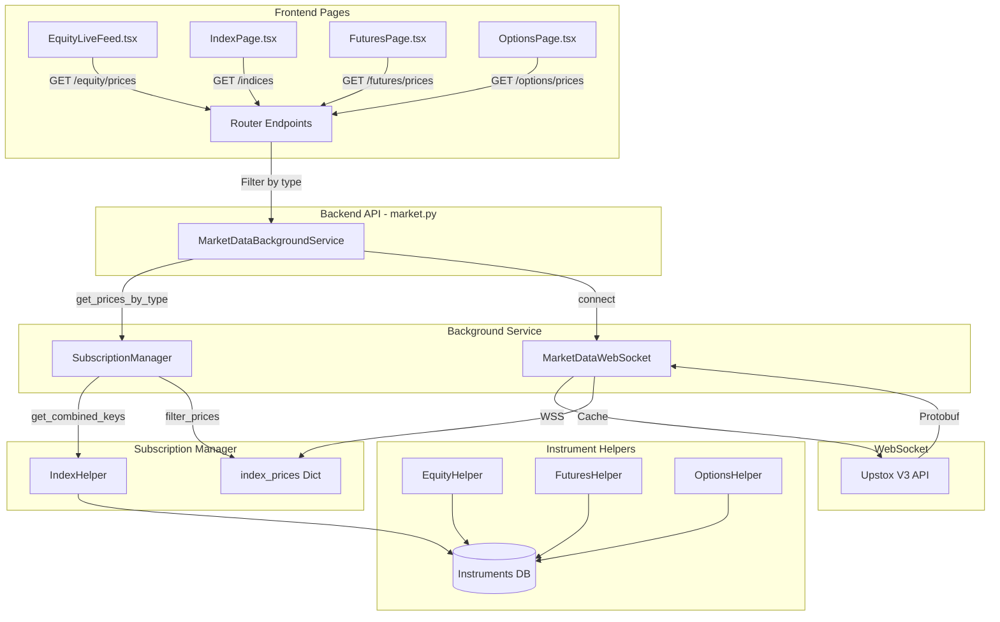

# Upstox Market Data WebSocket V3 - Documentation

## Overview

This document explains the WebSocket integration for real-time market data using the Upstox Market Data Feed V3 API. The system runs a **background WebSocket service** that subscribes to ALL instruments and provides type-filtered endpoints for the frontend.

---

## Architecture Diagram



---

## Key Components

### 1. MarketDataBackgroundService
**File:** `backend/services/market_data_background.py`

Manages the WebSocket connection as a background service:
- Starts on user login
- Collects ALL instrument keys from helpers
- Subscribes to Upstox WebSocket
- Provides type-filtered price access

```python
from services.market_data_background import market_data_service

# Start service (called automatically on login)
await market_data_service.start(access_token, db)

# Get status
status = market_data_service.get_status()

# Get filtered prices
equity_prices = market_data_service.get_prices_by_type('equity')
index_prices = market_data_service.get_prices_by_type('index')
```

### 2. InstrumentSubscriptionManager
**File:** `backend/helpers/instruments/subscription_manager.py`

Coordinates instrument collection and filtering:
- Collects keys from all helpers
- Tracks which keys belong to which type
- Filters cached prices by type

```python
from helpers.instruments.subscription_manager import subscription_manager

# Collect ALL instrument keys
all_keys = subscription_manager.get_combined_keys(db)
# Returns: ['NSE_INDEX|Nifty 50', 'NSE_EQ|INE009A01021', ...]

# Filter prices by type
equity_prices = subscription_manager.filter_prices_by_type(all_prices, 'equity')
```

### 3. Instrument Helpers
**Directory:** `backend/helpers/instruments/`

| Helper | File | Purpose | Limit |
|--------|------|---------|-------|
| `IndexHelper` | `index.py` | NSE_INDEX, BSE_INDEX | 100 |
| `EquityHelper` | `equity.py` | NSE_EQ, BSE_EQ | 500 |
| `FuturesHelper` | `futures.py` | NSE_FO futures | 200 |
| `OptionsHelper` | `options.py` | CE/PE options | 500 |

### 4. MarketDataWebSocket
**File:** `backend/services/market_data_websocket.py`

The actual WebSocket client that:
- Connects to Upstox V3 WebSocket
- Subscribes to instrument keys
- Decodes Protobuf messages
- Caches prices in `index_prices` dict

---

## Data Flow

```
┌──────────────────────────────────────────────────────────────────┐
│                     BACKEND STARTUP / LOGIN                      │
├──────────────────────────────────────────────────────────────────┤
│                                                                  │
│   1. User logs in with Upstox token                              │
│                          ↓                                       │
│   2. POST /market-feed/connect                                   │
│                          ↓                                       │
│   3. MarketDataBackgroundService.start()                         │
│                          ↓                                       │
│   4. SubscriptionManager.get_combined_keys(db)                   │
│         ├── IndexHelper.get_all_keys() → 100 keys               │
│         ├── EquityHelper.get_all_keys() → 500 keys              │
│         ├── FuturesHelper.get_all_keys() → 200 keys             │
│         └── OptionsHelper.get_all_keys() → 500 keys             │
│                          ↓                                       │
│   5. Combined ~1300 unique instrument keys                       │
│                          ↓                                       │
│   6. MarketDataWebSocket.connect(token, keys)                    │
│                          ↓                                       │
│   7. WebSocket connected to Upstox V3                            │
│                          ↓                                       │
│   8. Live prices cached in index_prices dict                     │
│                                                                  │
└──────────────────────────────────────────────────────────────────┘

┌──────────────────────────────────────────────────────────────────┐
│                    FRONTEND PAGE REQUEST                         │
├──────────────────────────────────────────────────────────────────┤
│                                                                  │
│   1. EquityLiveFeed.tsx polls GET /market-feed/equity/prices     │
│                          ↓                                       │
│   2. market.py calls market_data_service.get_prices_by_type()    │
│                          ↓                                       │
│   3. subscription_manager.filter_prices_by_type(all, 'equity')   │
│                          ↓                                       │
│   4. Returns only equity prices to frontend                      │
│                          ↓                                       │
│   5. Frontend displays in table                                  │
│                                                                  │
└──────────────────────────────────────────────────────────────────┘
```

---

## API Endpoints

### Connection Management

| Endpoint | Method | Description |
|----------|--------|-------------|
| `/api/v1/market/market-feed/connect` | POST | Connect & subscribe to ALL instruments |
| `/api/v1/market/market-feed/disconnect` | POST | Stop background service |
| `/api/v1/market/market-feed/status` | GET | Get service status with subscription breakdown |

### Type-Filtered Price Endpoints

| Endpoint | Method | Returns |
|----------|--------|---------|
| `/api/v1/market/market-feed/indices` | GET | Index prices only |
| `/api/v1/market/market-feed/equity/prices` | GET | Equity prices only |
| `/api/v1/market/market-feed/futures/prices` | GET | Futures prices only |
| `/api/v1/market/market-feed/options/prices` | GET | Options prices only |
| `/api/v1/market/market-feed/all/prices` | GET | All cached prices |

---

## Endpoint Response Examples

### GET /market-feed/status
```json
{
    "status": "success",
    "data": {
        "service_running": true,
        "websocket_connected": true,
        "subscriptions": {
            "index": 15,
            "equity": 500,
            "futures": 200,
            "options": 500
        },
        "total_subscribed": 1215,
        "cached_prices": 1215
    }
}
```

### GET /market-feed/equity/prices
```json
{
    "status": "success",
    "type": "equity",
    "data": {
        "NSE_EQ|INE009A01021": {
            "ltp": 1850.50,
            "ltt": "1734860000",
            "ltq": "100",
            "cp": 1842.25,
            "change": 0.45,
            "updated_at": "2024-12-22T15:30:00"
        }
    },
    "count": 500
}
```

---

## Files Summary

```
backend/
├── services/
│   ├── market_data_background.py   # Background service (NEW)
│   └── market_data_websocket.py    # WebSocket client
│
├── helpers/
│   └── instruments/
│       ├── __init__.py             # Package exports
│       ├── subscription_manager.py # Coordinates helpers & filtering
│       ├── equity.py               # EquityHelper
│       ├── index.py                # IndexHelper
│       ├── futures.py              # FuturesHelper
│       ├── options.py              # OptionsHelper
│       ├── mtf.py                  # MTFHelper
│       └── mis.py                  # MISHelper
│
├── routers/
│   └── market.py                   # API endpoints with type filtering
│
└── middleware/
    └── helper/
        └── MarketDataFeed.proto    # Protobuf schema

frontend/
└── src/
    └── pages/
        └── EquityLiveFeed.tsx      # Shows equity prices only
```

---

## How Frontend Gets Type-Specific Data

### EquityLiveFeed.tsx

```typescript
// Connect to WebSocket (subscribes to ALL instruments)
const connectFeed = async () => {
    await api.post('/v1/market/market-feed/connect');
};

// Poll for equity prices only
useEffect(() => {
    const interval = setInterval(async () => {
        // This returns ONLY equity prices, filtered by backend
        const response = await api.get('/v1/market/market-feed/equity/prices');
        setLivePrices(response.data.data);
    }, 1000);
    return () => clearInterval(interval);
}, [isConnected]);
```

### Future: IndexPage, FuturesPage, OptionsPage

Each page would call its respective endpoint:
- `GET /market-feed/indices` for indices
- `GET /market-feed/futures/prices` for futures
- `GET /market-feed/options/prices` for options

All pages share the SAME WebSocket connection in the background!

---

## Quick Start

1. **Sync Instruments:**
   ```bash
   POST /api/v1/instruments/sync
   ```

2. **Connect to Feed (subscribes to ALL):**
   ```bash
   POST /api/v1/market/market-feed/connect
   ```

3. **Check Status:**
   ```bash
   GET /api/v1/market/market-feed/status
   ```

4. **Get Type-Specific Prices:**
   ```bash
   GET /api/v1/market/market-feed/equity/prices   # For equity page
   GET /api/v1/market/market-feed/indices         # For index page
   GET /api/v1/market/market-feed/futures/prices  # For futures page
   GET /api/v1/market/market-feed/options/prices  # For options page
   ```

---

## Key Design Decisions

1. **Single WebSocket for all types**: One background connection subscribes to all instruments. Frontend pages just filter the cached data.

2. **Type tracking**: `subscription_manager` keeps track of which instrument_key belongs to which type, enabling fast filtering.

3. **Background service**: Runs independently once started, survives page navigation.

4. **Configurable limits**: Each helper type has a limit to stay within Upstox subscription limits.

